<div class="MCWHeader1">
Enterprise-ready cloud
</div>

<div class="MCWHeader2">
Hands-on lab step-on-step
</div>

<div class="MCWHeader3">
November 2018
</div>

Information in this document, including URL and other Internet Web site references, is subject to change without notice. Unless otherwise noted, the example companies, organizations, products, domain names, e-mail addresses, logos, people, places, and events depicted herein are fictitious, and no association with any real company, organization, product, domain name, e-mail address, logo, person, place or event is intended or should be inferred. Complying with all applicable copyright laws is the responsibility of the user. Without limiting the rights under copyright, no part of this document may be reproduced, stored in or introduced into a retrieval system, or transmitted in any form or by any means (electronic, mechanical, photocopying, recording, or otherwise), or for any purpose, without the express written permission of Microsoft Corporation.

Microsoft may have patents, patent applications, trademarks, copyrights, or other intellectual property rights covering subject matter in this document. Except as expressly provided in any written license agreement from Microsoft, the furnishing of this document does not give you any license to these patents, trademarks, copyrights, or other intellectual property.

The names of manufacturers, products, or URLs are provided for informational purposes only and Microsoft makes no representations and warranties, either expressed, implied, or statutory, regarding these manufacturers or the use of the products with any Microsoft technologies. The inclusion of a manufacturer or product does not imply endorsement of Microsoft of the manufacturer or product. Links may be provided to third party sites. Such sites are not under the control of Microsoft and Microsoft is not responsible for the contents of any linked site or any link contained in a linked site, or any changes or updates to such sites. Microsoft is not responsible for webcasting or any other form of transmission received from any linked site. Microsoft is providing these links to you only as a convenience, and the inclusion of any link does not imply endorsement of Microsoft of the site or the products contained therein.

© 2018 Microsoft Corporation. All rights reserved.

Microsoft and the trademarks listed at <https://www.microsoft.com/en-us/legal/intellectualproperty/Trademarks/Usage/General.aspx> are trademarks of the Microsoft group of companies. All other trademarks are property of their respective owners

**Contents** 

<!-- TOC -->

- [Enterprise-ready cloud hands-on lab step-by-step](#enterprise-ready-cloud-hands-on-lab-step-by-step)
  - [Abstract and learning objectives](#abstract-and-learning-objectives)
  - [Overview](#overview)
  - [Requirements](#requirements)
  - [Solution architecture](#solution-architecture)
  - [Exercise 1: Create the policy for Enterprise IT](#exercise-1-create-the-policy-for-enterprise-it)
    - [Help references](#help-references)
    - [Task 1: Create a Management Group](#task-1-create-a-management-group)
    - [Task 2: Apply the service catalog policy](#task-2-apply-the-service-catalog-policy)
    - [Task 3: Restrict the creation of ExpressRoute circuits](#task-3-restrict-the-creation-of-expressroute-circuits)
    - [Task 4: Restrict the creation of resources in regions](#task-4-restrict-the-creation-of-resources-in-regions)
    - [Task 5: Create and apply a naming convention](#task-5-create-and-apply-a-naming-convention)
    - [Task 6: Test the policies](#task-6-test-the-policies)
  - [Exercise 2: Configure delegated permissions](#exercise-2-configure-delegated-permissions)
    - [Help references](#help-references-1)
    - [Task 1: Create groups in Azure AD for delegation](#task-1-create-groups-in-azure-ad-for-delegation)
    - [Task 2: Create user accounts in Azure AD for delegation](#task-2-create-user-accounts-in-azure-ad-for-delegation)
    - [Task 3: Enable a business unit administrator for the subscription](#task-3-enable-a-business-unit-administrator-for-the-subscription)
    - [Task 4: Enable project-based delegation and chargeback with tags](#task-4-enable-project-based-delegation-and-chargeback-with-tags)
  - [Exercise 3: Use Azure Blueprints to govern your Azure environment](#exercise-3-use-azure-blueprints-to-govern-your-azure-environment)
    - [Help references](#help-references-2)
    - [Task 1: Create a new Azure Blueprint](#task-1-create-a-new-azure-blueprint)
    - [Task 2: Publish a draft blueprint and assign it](#task-2-publish-a-draft-blueprint-and-assign-it)
    - [Task 3: Update the Service catalog policy to allow blueprint assignments](#task-3-update-the-service-catalog-policy-to-allow-blueprint-assignments)
    - [Task 4: Assign a blueprint](#task-4-assign-a-blueprint)
    - [Task 5: Verify blueprint policy and resource creation](#task-5-verify-blueprint-policy-and-resource-creation)
  - [After the hands-on lab](#after-the-hands-on-lab)
    - [Task 1: Remove resources and configuration created during this lab](#task-1-remove-resources-and-configuration-created-during-this-lab)

<!-- /TOC -->

# Enterprise-ready cloud hands-on lab step-by-step

## Abstract and learning objectives 

In this hands-on lab, you are working with Trey Research to setup some best practices regarding policies, permissions, and managing their Azure subscriptions using advanced tooling such as Azure Blueprints. Tasks include creating scripts that Enterprise IT will use to automatically set policy and delegate permissions when a new subscription is created. You will also learn how to manage these policies and permissions for multiple subscriptions using Azure Management Groups and Azure Blueprints.

At the end of this hands-on lab, you will know how to provide cost tracking by business unit, environment and project, provide for a distributed administration model, put a service catalog in place to prevent deployment of unsupported Azure services, and put controls in place to allow deployment of services only in specific regions.

## Overview

Trey Research is a manufacturing company that builds consumer products with 29.6 billion USD in annual revenue. Trey's headquarters are in New Jersey, but they have data centers and branch offices scattered across the United States; with several major offices in the United Kingdom, France, and Japan.

Even as large as it is, Trey seeks to maximize the cost-effectiveness and flexibility of its IT, especially in new projects and business units. With a dizzying number of existing business units; each with their own unique requirements from IT and ballooning costs from internal hardware and data center investment, Trey is looking to the cloud.

Trey is interested in a large-scale solution that will help mitigate creeping costs and start the transition to a modern cloud-based enterprise architecture using a solid set of controls for governance.

## Requirements

1. Full global admin access to the Azure AD tenant associated with your Azure subscription.

## Solution architecture


## Exercise 1: Create the policy for Enterprise IT 

Duration: 60 minutes

In this exercise, you will first create a Management Group for your Azure subscription(s). You will apply several of the built-in Azure Policy definitions to that Management Group to ensure that users stay within the scope of supported services for Enterprise IT. Finally, you will create a new policy initiative defining a multi-resource naming convention and apply that initiative to the Management Group.

### Help references

|    |            |
|----------|:-------------:|
| Governance in the Microsoft CAF for Azure | https://docs.microsoft.com/azure/architecture/cloud-adoption/governance/overview |
| The Five Disciplines of Cloud Governance | https://docs.microsoft.com/azure/architecture/cloud-adoption/governance/governance-disciplines |
| Azure Policy | <https://docs.microsoft.com/azure/azure-policy/azure-policy-introduction> |
| Azure Management Groups | <https://docs.microsoft.com/azure/azure-resource-manager/management-groups-overview> |

### Task 1: Create a Management Group

In this task, you will create a new Management Group and move a subscription into this Management Group. We'll later assign Azure Policy using the Management Group scope, so that it applies automatically to all subscriptions under that scope.

> **Note**: We'll use our own Management Group, if you have permissions you could also use the Tenant Root Management Group.

1. Launch the Azure Management Portal, and navigate to **Management Groups** under **All services**:

    

2. Select **Start using management groups** to launch the **Add management group** blade.

    

    or if you already have management groups in place, you can use the **Add management group** button to launch the **Add management group** blade.

    

3. In the **Add management group** blade  fill in the management group ID and display name (we'll use 'ERC' as the management group ID and 'Enterprise Ready Cloud' as the display name). If you have existing management groups, create this as a child of Root and select **Save**.

    

    > **Note**: If this is the first management group being created, note that it may take up to 15 minutes for it to complete.

    

4. Select the newly-created management group, then select **details**.
    
    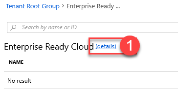

    Select **Add Subscription** and for the subscription, choose your subscription from the drop-down list, then select **Save**.

    

### Task 2: Apply the service catalog policy

In this exercise, you will apply one of the built-in Azure Policies to restrict services to the supported list provided by Trey Research.

1. First, we need to build a list of resource types, which will be permitted, and their corresponding resource providers. One way to do this is to use PowerShell. Launch the Azure Cloud Shell and select PowerShell. If prompted to create storage, click the **Create storage** button.

    

    

2. Enter the following script into the window and run the script:

    ```powershell
    $FormatEnumerationLimit = -1
    Get-AzResourceProvider `
        | Select-Object ProviderNamespace, ResourceTypes `
        | Format-List
    ```

3. Review the list, and identify the resource providers and resource types for each of the following:

    ```s
    Resource Name
    --------------------------
    - Resource Group
    - Virtual Machines
    - Disk
    - Network Interface
    - Public IP Address
    - Network Security Group
    - Virtual Networks
    - Virtual Network Gateways
    - ExpressRoute Circuits
    - VPN Gateways
    - Storage Accounts
    - Backup Vault
    - Site Recovery Vault
    - DevTest Labs
    - Key Vault
    - Web Apps
    - SQL Database
    ```

    For example, to find all of the resource providers with resource groups as a resource type, a query like the following could be used:

    ```powershell
    Get-AzResourceProvider `
        | Select-Object ProviderNamespace, ResourceTypes `
        | Where-Object { $_.ResourceTypes.ResourceTypeName -like "*resource*groups*" } `
        | Format-List
    ```

    This query shows that the `resourceGroups` resource type is a member of the resource provider `Microsoft.Resources`.

    By altering the `-like` clause, you can filter to easily find the resource providers for the remaining resource types.

    > **Note:** If you do not see the Microsoft.Compute resource provider it is because you have not yet created any compute resources. You can manually register the provider with the following command:

    ```powershell
    Register-AzureRmResourceProvider -ProviderNamespace Microsoft.Compute
    ```

4. Launch the Azure Management portal, and navigate to **Policy** under **All services**:

    

    > **Hint**: Click the star next to the Policy service to pin it to your Portal navigation. You will visit the Policy service throughout the lab.

5. Select **Definitions**, then **+ Policy definition**. 

     

6.  In the Policy definition blade, use the following configurations:

    - Definition location: **Enterprise Ready Cloud** (ERC) management group, as created in Task 1
    - Name: **Service catalog**
    - Description: **Restrict resource types to those permitted by Enterprise IT**
    - Category: **Create new** > **Service catalog**
    - Policy rule: ***Replace the default JSON with the following code:***

    ```json
    {
        "policyRule": {
            "if": {
                "not": {
                    "anyOf": [
                        {
                        "source": "action",
                        "like": "Microsoft.Resources/*"
                        },
                        {
                        "source": "action",
                        "like": "Microsoft.Compute/virtualMachines/*"
                        },
                        {
                        "source": "action",
                        "like": "Microsoft.Compute/virtualMachines/extensions/*"
                        },
                        {
                        "source": "action",
                        "like": "Microsoft.Compute/virtualMachines/locations/*"
                        },
                        {
                        "source": "action",
                        "like": "Microsoft.Compute/virtualMachines/disks/*"
                        },
                        {
                        "source": "action",
                        "like": "Microsoft.Compute/disks/*"
                        },
                        {
                        "source": "action",
                        "like": "Microsoft.Compute/virtualMachines/diagnosticSettings/*"
                        },
                        {
                        "source": "action",
                        "like": "Microsoft.Compute/virtualMachines/metricDefinitions/*"
                        },
                        {
                        "source": "action",
                        "like": "Microsoft.Compute/virtualMachines/images/*"
                        },
                        {
                        "source": "action",
                        "like": "Microsoft.Compute/availabilitySets/*"
                        },
                        {
                        "source": "action",
                        "like": "Microsoft.Network/loadBalancers/*"
                        },
                        {
                        "source": "action",
                        "like": "Microsoft.Network/virtualNetworks/*"
                        },
                        {
                        "source": "action",
                        "like": "Microsoft.Network/networkSecurityGroups/*"
                        },
                        {
                        "source": "action",
                        "like": "Microsoft.Network/publicIPAddresses/*"
                        },
                        {
                        "source": "action",
                        "like": "Microsoft.Network/networkInterfaces/*"
                        },
                        {
                        "source": "action",
                        "like": "Microsoft.Network/operations/*"
                        },
                        {
                        "source": "action",
                        "like": "Microsoft.Network/locations/*"
                        },
                        {
                        "source": "action",
                        "like": "Microsoft.Network/expressRouteCircuits/*"
                        },
                        {
                        "source": "action",
                        "like": "Microsoft.Network/virtualNetworkGateways/*"
                        },
                        {
                        "source": "action",
                        "like": "Microsoft.Network/vpnGateways/*"
                        },
                        {
                        "source": "action",
                        "like": "Microsoft.Network/p2sVpnGateways/*"
                        },
                        {
                        "source": "action",
                        "like": "Microsoft.Storage/*"
                        },
                        {
                        "source": "action",
                        "like": "Microsoft.RecoveryServices/*"
                        },
                        {
                        "source": "action",
                        "like": "Microsoft.DevTestLab/*"
                        },
                        {
                        "source": "action",
                        "like": "Microsoft.KeyVault/*"
                        },
                        {
                        "source": "action",
                        "like": "Microsoft.Web/*"
                        },
                        {
                        "source": "action",
                        "like": "Microsoft.SQL/*"
                        },        
                        {
                        "source": "action",
                        "like": "Microsoft.Authorization/*"
                        },
                        {
                        "source": "action",
                        "like": "Microsoft.Insights/*"
                        }
                    ]
                }
            },
            "then" : {
                "effect" : "deny"
            }
        }
    }
    ```

1. Click **Save**.

7. On the ***Policy \- Definitions*** blade, select the **Service catalog** policy definition you just created and then select **Assign** on the *Service catalog* blade.

    

    > **Note**: If you do not see the policy, make sure "Enterprise Ready Cloud" is the selected scope, and not another Management group or an individual subscription.

8. On the ***Service catalog \- Assign policy blade***, specify the following configurations and then click **Assign** to assign your policy definition to your Enterprise Ready Cloud management group:

    - Scope: **Enterprise Ready Cloud**
    - Exclusions: **None**
    - Policy definition: **Service catalog**
    - Assignment name: **Service catalog policy**
    - Description: **Restrict resource types to those permitted by Enterprise IT**
    - Assigned by: **Enterprise IT**

    The assignment form should look like this:

    

### Task 3: Restrict the creation of ExpressRoute circuits

In this exercise, you will apply another built-in Azure policy to restrict the creation of ExpressRoute circuits. For this policy, we'll use an exclusion scope for the resource group in which Enterprise IT will create the permitted ExpressRoute circuits.

1. First, we'll create the resource group for the exclusion scope. Select **Resource groups**, then **Add**, and then fill in the resource group name **ExpressRouteRG**, select your subscription, and choose a resource group location:

    

1. Once complete, select **Review + Create** and then **Create**.

2. Return to the **Policy** blade in the Azure portal. Select **Assignments**, then **Assign Policy**. Complete the form as follows:

    - Scope: **Enterprise Ready Cloud** (the management group created earlier)
    - Exclusions: **The resource group created in Step 1 above. Select the management group, subscription, and resource group**.    
    - Policy definition: **Not allowed resource types**
    - Assignment name: **Block ExpressRoute circuits**
    - Description: **Block creating of ExpressRoute circuits, except in the Enterprise IT dedicated ExpressRoute resource group**
    - Assigned by: **Enterprise IT**
    - Parameters \| Not allowed resource types: **Microsoft.Network/expressRouteCircuits**

    The assignment form should look like this:

    

3. When complete, select **Assign** to create the policy assignment.

### Task 4: Restrict the creation of resources in regions 

In this exercise, you will create a new Azure Policy assignment that restricts the regions in which resources can be created in.

1. In the Azure portal, navigate to **Policy**, then select **Assignments**, then **Assign Policy**. Complete the form as follows:

    - Scope: **Enterprise Ready Cloud**
    - Exclusions: **None**
    - Policy definition: **Allowed locations**
    - Assignment name: **Restrict Azure locations**
    - Description: **Restrict Azure resources to the list of Azure regions permitted by Enterprise IT**.
    - Assigned by: **Enterprise IT**
    - Parameters \| Allowed locations: **East US, West US, North Europe, West Europe, Japan East, Japan West**

    The assignment form should look like this:

    

2. When complete, select **Assign** to create the policy assignment.

### Task 5: Create and apply a naming convention

In this task, we will define a simple naming convention for Azure resources. We shall simply require that virtual machine names end with ***-vm*** and virtual networks end with ***-vnet***. We will implement this naming convention using a custom policy definition and a policy initiative, assigned at the management group scope.

First, we will create a generic policy definition that restricts resources of a given type to have a given name suffix. The resource type and name suffix will be specified using parameters.

1. In the Azure portal, open the **Policy** blade, then select **Definitions** and then **+ Policy definition**.

    

2. Complete the Policy definition form as follows:

    - Definition location: **Enterprise Ready Cloud** (the Management Group created earlier)
    - Name: **Restrict Resource Name Suffix**
    - Description: **Restrict resources of a given type to have a name ending with a given suffix. The resource type and suffix are parameterized.**
    - Category:  **Create new** > **Naming"**
    - Policy rule and parameters: **As shown below:**

    ```json
    {
        "properties": {
            "mode": "all",
            "parameters": {
                "resourceType": {
                    "type": "string",
                    "metadata": {
                        "displayName": "Resource Type",
                        "description": "The resource type for this policy",
                        "strongType": "resourceTypes"
                    }
                },
                "nameSuffix": {
                    "type": "string",
                    "metadata": {
                        "displayName": "Resource Name Suffix",
                        "description": "The suffix that must be appended"
                    }
                }
            },
            "policyRule": {
                "if": {
                    "allof": [
                    {
                        "field": "type",
                        "equals": "[parameters('resourceType')]"
                    },
                    {
                        "not": {
                        "field": "name",
                        "like": "[concat('*-', parameters('nameSuffix'))]"
                        }
                    }
                    ]
                },
                "then": {
                    "effect": "deny"
                }
            }
        }
    }
    ```

1. Once the policy definition is complete, select **Save**.

3. Next, we shall create a policy initiative comprising multiple instances of our policy definition (one per resource type).

    From the **Policy** blade, on the **Definitions** panel, select **+ Initiative Definition**.

4. Fill in the **Initiative definition** blade as follows (but **do not** select **Save** yet).

    - Definition location: **Enterprise Ready Cloud** (the Management Group created earlier)
    - Name: **Naming Convention**
    - Description: **Trey Research resource naming convention**
    - Category: **Use Existing** > **Naming**

    

5. Under ***Available Definitions***, find the *Restrict Resource Name Suffix* policy definition created in Step 2.

    

6. Select the policy definition, then select **+Add** to add the Policy Definition to the Policy Initiative.

    

7. Select the resource type and name suffix. In this case, we'll choose **Microsoft.Compute/virtualMachines** as the resource type and **vm** as the name suffix. **Do not click Save**.

    

8. Repeat steps 5, 6, and 7 above for each of the following resource types:

    - Virtual Networks
        - Resource Type: **Microsoft.Network/virtualNetworks**
        - Resource Name Suffix: **vnet** 

9. Once you've added each resource type, select **Save**.

10. Finally, we will apply the policy initiative across all subscriptions in the Management Group by creating an assignment at the Management group scope.

    On the **Policy** blade, select **Assignments** and then **Assign Initiative**.

    

11. Complete the Assign Initiative form as follows:

    - Scope: **Enterprise Ready Cloud** (the Management Group created earlier)
    - Exclusions: **None**
    - Initiative definition: **Naming Convention** (the initiative definition we just created).
    - Assignment name: **Resource Naming Convention**
    - Description: **Enforces company-wide resource naming convention**
    - Assigned by: **Enterprise IT**

    The assignment form should look like this:

    

12. When complete, select **Assign** to create the policy initiative assignment.

### Task 6: Test the policies 

In this task, you will use the Azure management portal to validate each of the policies created so far, and understand how to identify policy events.

#### Subtask 1: Test the service catalog policy <!-- omit in toc -->

1. Select **Create a Resource \> Internet of Things \> IoT Hub**.

    

2. Specify a unique name for the IoT Hub, and choose an existing resource group. Choose a permitted location (we are only testing the Service Catalog policy at this time).

    Once all the settings have been filled in, select **Review + create** followed by **Create**.

    

3. The IoT Hub creation blade should show an error:

    

#### Subtask 2: Test the ExpressRoute circuit policy <!-- omit in toc -->

1. Select **Create a resource** **\>** **Networking** **\>** **ExpressRoute**.

    

2. Specify the following configuration for the circuit and select **Create**.

    - Create new or import from classic: **Create new**
    - Circuit name: **TestCircuit**
    - Provider: **AT&T**
    - Peering location: **Silicon Valley**
    - Bandwidth: **50Mbps**
    - SKU: **Standard**
    - Billing model: **Unlimited**
    - Subscription: **Select your Azure subscription**
    - Resource group: **Any resource groupe *except* ExpressRouteRG OR Create new**
    - Location: **Any available location in the allowed locations policy**

     

3. As with the Service Catalog policy, you should see an error in the Create ExpressRoute Circuit blade, which when clicked shows the error details:

    

    

    > **Note**: If you created a new resource group in the previous step, you will see that the resource group has been created even though the deployment of the resource failed. This is because the policy that was created to restrict the creation of ExpressRoute circuits specifically targets that Azure resource type and a resource group is another distinct resource type.

#### SubTask 3: Test the resource location policy <!-- omit in toc -->

1. Testing the resource location policy follows a similar pattern. Attempt to create a permitted resource, with a permitted name, but in a not-permitted region. For example, attempt to create a virtual network named 'erc-vnet' in South Central US. This should be rejected by the 'Restrict Azure locations' policy.

    

2. To test further, change to a permitted location (e.g. East US) and try again. This time, the virtual network should be created without issue.

    > **Note**: Recall that an initiative assignment was made earlier to deny the creation of resources that do not meet the organizational naming conventions. If you had attempted to create a virtual networking without `-vnet` in its name, the creation of the resource would have been denied by the initiative assignment and its associated configuration.

#### SubTask 4: Test the naming convention policy <!-- omit in toc -->

1. Attempt to create a permitted resource, in a permitted location, with a not-permitted name. For example, create a virtual network named 'erc-network' in East US. This should be rejected by the 'Resource Naming Convention' policy.

2. To test further, change to a permitted name (e.g. 'erc-network-vnet') and try again---this time, the virtual network should be created without issue.

## Exercise 2: Configure delegated permissions

Duration: 60 minutes

In this exercise, you will configure delegated permissions for users in the Trey Research business unit. You will use the Azure AD Graph commands in the Azure CLI to work with users and groups and you will extend a PowerShell script to automatically provision a limited access user with the configuration of the subscription.

### Help references

|    |            |
|----------|:-------------:|
| Add new users to Active Directory | <https://docs.microsoft.com/azure/active-directory/add-users-azure-active-directory> |
| How Subscriptions are associated with Azure AD | <https://docs.microsoft.com/azure/active-directory/active-directory-how-subscriptions-associated-directory> |
| Managing Azure AD Security Groups | <https://docs.microsoft.com/azure/active-directory/active-directory-groups-create-azure-portal> |
| Role Based Access Control  | <https://docs.microsoft.com/azure/active-directory/role-based-access-control-configure> |
| Manage RBAC with PowerShell | <https://docs.microsoft.com/azure/active-directory/role-based-access-control-manage-access-powershell> |
| Manage Azure Active Directory Graph entities needed for RBAC | <https://docs.microsoft.com/cli/azure/ad?view=azure-cli-latest> |

### Task 1: Create groups in Azure AD for delegation 

In this task, you will create two groups in Azure AD that you will use for testing delegated access control. In the next task, users will be created that will be added to these new security groups.

1. Launch the Azure Cloud Shell and select PowerShell. If prompted to create storage, click the **Create storage** button.

    

    

    > **Note**: In the following commands, we will use the Azure CLI to provision users and groups in Azure AD. The PowerShell Cloud Shell gives us access to *both* the Azure PowerShell module (Az) and the Azure CLI.

2. In the shell, execute the following script to create two new security groups.

    ```powershell
    az ad group create --display-name "BU-Electronics-Admins" --mail-nickname "BU-Electronics-Admins"
    az ad group create --display-name "BU-Electronics-Users" --mail-nickname "BU-Electronics-Users"
    ```

### Task 2: Create user accounts in Azure AD for delegation 

In this task, you will create two user accounts in Azure AD that you will use for testing delegated access control.

1. Execute the following script to find out the name of your Azure AD tenant (this will be needed in the next step) and store it in a variable.

    ```powershell
    $aadDomain = (az ad signed-in-user show --query userPrincipalName -o tsv).Split("@")[1]
    echo $aadDomain
    ```

1. Create the first user, **Electronics Admin** and add the user to the **BU-Electronics-Admins** security group.

    ```powershell
    az ad user create --display-name "Electronics Admin" --password "demo@pass123" --user-principal-name "ElectronicsAdmin@$aadDomain"
    $memberId = (az ad user show --upn-or-object-id "ElectronicsAdmin@$aadDomain" --query objectId -o tsv)
    az ad group member add --group "BU-Electronics-Admins" --member-id $memberId
    ```

1. Next, create the user **Electronics User** and add the user to the **BU-Electronics-Users** security group.

    ```powershell
    az ad user create --display-name "Electronics User" --password "demo@pass123" --user-principal-name "ElectronicsUser@$aadDomain"
    $memberId = (az ad user show --upn-or-object-id "ElectronicsUser@$aadDomain" --query objectId -o tsv)
    az ad group member add --group "BU-Electronics-Users" --member-id $memberId
    ```

### Task 3: Enable a business unit administrator for the subscription 

In this task, you will update a script to automatically add a user to the contributor role of the subscription.

1. Launch the Azure Cloud Shell and select PowerShell. If prompted to create storage, click the **Create storage** button.

    

    

2. Create a new script the Cloud Shell using **code** by typing the following:

    ```s
    code 
    ```

3.  Add the following code to script, and save the file. This code will retrieve the object ID for the Active Directory group passed in and assign the group to the Contributor role on the subscription.

    ```powershell
    param([string]$SubscriptionId, [string]$AdGroupName) 

    Select-AzSubscription -SubscriptionId $SubscriptionId

    $scope = "/subscriptions/$SubscriptionId"

    $groupObjectId = (Get-AzADGroup -SearchString $AdGroupName).Id.Guid

    Write-Output "Adding group to contributor role"

    New-AzRoleAssignment -Scope $scope `
                            -RoleDefinitionName "Contributor" `
                            -ObjectId $groupObjectId 
    ```

    This code will add an Azure AD security group to the contributor role at the subscription scope.

4. Save the file as **ConfigureSubscription.ps1** by clicking **Save** in the menu behind the ellipsis (...).

    

1. Close **code** using the **Close Editor** command by clicking **Close Editor** in the menu behind the ellipsis (...).

5. Create a local variable in the **Console** containing your Subscription ID (you can copy your subscription ID from the Azure portal, or obtain it using `Get-AzSubscription`). In this example, we will obtain is using the referenced cmdlet.

    ```powershell
    $SubscriptionId = (Get-AzSubscription).SubscriptionId
    ```

    > **Note**: If your account has access to multiple Azure subscriptions you may need to alter the command to target the proper subscription using the `-SubscriptionId` or `-SubscriptionName` parameter with the `Get-AzSubscription` cmdlet.

6. Execute the script passing in the `-SubscriptionID` and `-AdGroupName` parameters:

    ```powershell
    . $HOME\ConfigureSubscription.ps1 -SubscriptionId $SubscriptionId -AdGroupName "BU-Electronics-Admins"
    ```

7. In a different type of browser, or in an In-Private or Incognito mode window in your current browser navigate to the Azure management portal in a browser <http://portal.azure.com>, and sign in using the **ElectronicsAdmin** credentials created earlier. 

    > **Note**: You may be prompted to configure a method of resetting your account. If you are, you can choose either a phone call or email.

8. Select **All services**, search for **Subscriptions**, and then select **Subscriptions**.

    

9.  Select the name of the subscription you have been working on.

10. Select the **Access control (IAM)** tile and click the **Role assignments** tab:

    

11. You should see the **BU-Electronics-Admins** group assigned to the contributor role.

    

    > **Note**: Users in the Contributor role scoped at the subscription have full access to all the resources within the subscription, but cannot grant access to others or change policies on the subscription.

### Task 4: Enable project-based delegation and chargeback with tags

In this task, you will create a script that will create a new resource group, assign 'Owner' rights over the resource group to a given AD group, and then apply a policy to enforce an 'IOCode' and 'CostCenter' tag with a given value.

1. Login to the Azure portal at <https://portal.azure.com> using your normal credentials (not the ElectronicsAdmin account). 

2. Launch the Azure Cloud Shell and select PowerShell. If prompted to create storage, click the **Create storage** button.

    

    

3. Create a new script called **CreateProjectResourceGroup.ps1** and open in the Cloud Shell using **code** by typing the following:

    ```s
    touch CreateProjectResourceGroup.ps1; code CreateProjectResourceGroup.ps1
    ```

4. Add the following code to the script, and **Save** the file:

    ```powershell
    param(
        [string]$SubscriptionId, 
        [string]$ResourceGroupName, 
        [String]$Location, 
        [String]$IOCode,
        [String]$CostCenter,
        [string]$AdGroupName
    ) 

    Select-AzSubscription -SubscriptionId $SubscriptionId

    # Create resource group
    New-AzResourceGroup -Name $ResourceGroupName -Location $Location 

    $scope = "/subscriptions/$subscriptionId/resourceGroups/$resourceGroupName"

    # Assign Owner role to given group
    $groupObjectId = (Get-AzADGroup -SearchString $AdGroupName).Id

    New-AzRoleAssignment -Scope $scope `
                            -RoleDefinitionName "Owner" `
                            -ObjectId $groupObjectId

    # Assign policy to apply IOCode tag
    $definition = Get-AzPolicyDefinition | where {$_.Properties.displayName -eq "Append tag and its default value"}

    $parameters = @{
        tagName = 'IOCode'
        tagValue = $IOCode
        }

    New-AzPolicyAssignment -Name "AppendIOCode" `
                                -Scope $scope `
                                -DisplayName "Append IO Code" `
                                -PolicyDefinition $definition `
                                -PolicyParameterObject $parameters
    
    # Assign policy to apply CostCenter tag
    $definition = Get-AzPolicyDefinition | where {$_.Properties.displayName -eq "Append tag and its default value"}

    $parameters = @{
        tagName = 'CostCenter'
        tagValue = $CostCenter
        }

    New-AzPolicyAssignment -Name "AppendCostCenter" `
                                -Scope $scope `
                                -DisplayName "Append Cost Center" `
                                -PolicyDefinition $definition `
                                -PolicyParameterObject $parameters
    ```

    This code creates a new resource group in the specified region. It then assigns the group to the owner role definition just for the resource group. It will allow users in the group to have full ownership of resources within the resource group only. This code applies a built-in policy to append a tag with name 'IOCode' and another tag for 'CostCenter' and then applies the given tag value to any resource created in the resource group.

    > **Note**: The 'Apply tag and its default value' policy applies tags to the resources included in the assignment scope, but it does not apply any tags to the parent resource group for those resources. It is important to understand that in Azure, tags are not automatically inherited from a parent object without additional configuration.

1. Close **code** using the **Close Editor** command by clicking **Close Editor** in the menu behind the ellipsis (...).

5. In the **Console** pane, create a new variable called **\$location**, and specify a region name to deploy to the resource group to. This location must be one of the supported regions in your previously created policy.

    ```powershell
    $location = "East US"
    ```

6. In the **Console** pane, create a new variable called **\$resourceGroupName**, and specify the value as **DelegatedProjectDemRG**. Also, make sure you create a **\$SubscriptionId** variable as you did earlier.

    ```powershell
    $resourceGroupName = "DelegatedProjectDemoRG"
    $SubscriptionId = (Get-AzSubscription).SubscriptionId
    ```

    > **Note**: If your account has access to multiple Azure subscriptions you may need to alter the command to target the proper subscription using the `-SubscriptionId` or `-SubscriptionName` parameter with the `Get-AzSubscription` cmdlet.

    > **Note**: If you receive an error similar to the following `Get-AzSubscription : The access token expiry UTC time '4/24/2019 3:31:22 PM' is earlier than current UTC time '4/24/2019 3:44:34 PM'.` you can re-authenticate to your Azure account using the `Connect-AzAccount` cmdlet.

7. In the **Console** pane, execute the following command to create a new resource group with delegated permissions and IO Code and Cost Center policies scoped to the resource group.

    ```powershell
    . $HOME\CreateProjectResourceGroup.ps1 -SubscriptionId $SubscriptionId -ResourceGroupName $resourceGroupName -Location $location -IOCode "1000150" -CostCenter "Marketing" -AdGroupName "BU-Electronics-Admins"
    ```

8. Create a new storage account in the resource group (choose a unique name) to validate the ioCode tag was applied (replace *uniquestorageaccount* with a unique value).

    ```powershell
    New-AzStorageAccount -ResourceGroupName $resourceGroupName `
        -Name "uniquestorageaccount" `
        -SkuName Standard_LRS `
        -Location $location 
    ```

9. You can now search for resources with the applied tags to verify the policy has been applied. Execute the following PowerShell to validate that the storage account has been tagged.
   
    ```powershell
    Get-AzResource -TagName IOCode
    Get-AzResource -TagName CostCenter
    ```
    
    In the output, you should see your storage account returned for each tag.

    

    > **Note**: It can take several minutes for the policies assignments that were made in the previous step to take effect. If you find that the tags were not automatically applied, delete the storage account and recreate it. After recreating it, you should see the tags applied with the `Get-AzResource` cmdlet.

10. Switch back to the Azure Management portal using the ElectronicsAdmin credentials.

11. Select **Resource Groups**.

12. Select the **DelegatedProjectDemoRG** resource group.

    

13. Select the **Access control (IAM)** icon, then select the **Role assignments** tab. Note that the BU-Electronics-Admins security group is set as an Owner of the resource group.

    

14. Select **+ Add** followed by **Add role assignment**.

    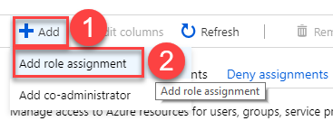

15. Select **Owner** for the Role.

    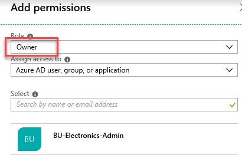

16. Select the **BU-Electronics-Users group** and select **Save** to add the group to the role.

    

Now both the security groups **BU-Electronics-Admins** and **BU-Electronics-Users** are both Owners of at the **DelegatedProjectDemoRG** scope and members of each security group have full control over the resource group and all of its resources.

## Exercise 3: Use Azure Blueprints to govern your Azure environment

Duration: 45 minutes

In this exercise you will create an Azure Blueprint at the Management Group scope to model your Azure environment using Azure Blueprint artifacts such as resource groups, Azure Resource Manager templates, resource locks, Azure Policy, and Azure RBAC.

### Help references

|    |            |
|----------|:-------------:|
| Overview of the Azure Blueprints service  | <https://docs.microsoft.com/azure/governance/blueprints/overview> |
| Understand resource locking in Azure Blueprints | https://docs.microsoft.com/azure/governance/blueprints/concepts/resource-locking |
| Azure Resource Manager overview | https://docs.microsoft.com/azure/azure-resource-manager/resource-group-overview |
| Understand the structure and syntax of Azure Resource Manager templates | https://docs.microsoft.com/azure/azure-resource-manager/resource-group-authoring-templates |

### Task 1: Create a new Azure Blueprint

In this task, you will create a new Azure Blueprint and add several artifacts to the blueprint. You will then save a draft of the blueprint.

1. In the Azure portal at <https://portal.azure.com> navigate to the Azure Blueprints service by selecting **All services**, searching for **Blueprints**, and then selecting **Blueprints**.

    

    > **Tip**: You can pin the Blueprints service to the portal navigation by clicking the star next to **Blueprints**.

2. In the **Getting started** blade, click **Create** under the *Create a blueprint* heading.

    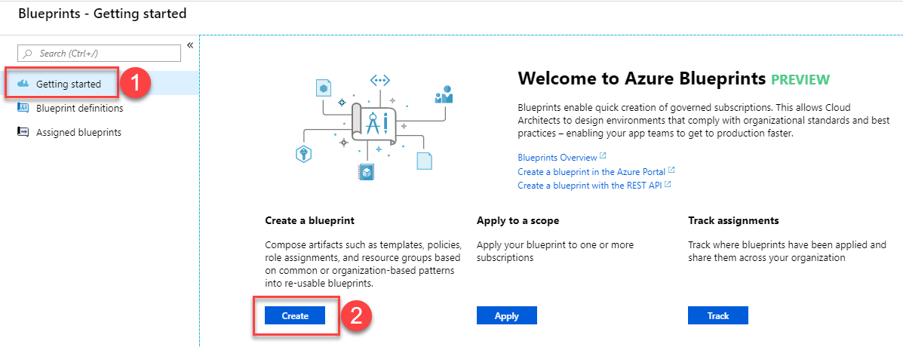

3. Select **Start with a blank blueprint**.

    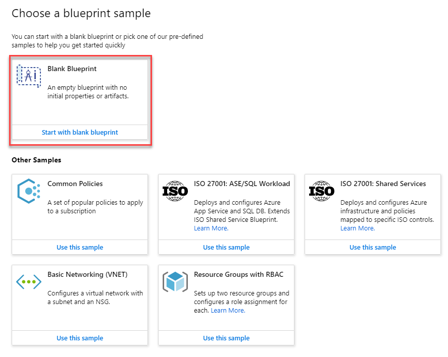

1. In the **Create blueprint** blade, enter the following to complete the form:

    - Blueprint name: **governance-baseline**
    - Blueprint description: **The governance-baseline blueprint will be applied to all subscriptions within the ERC management group.**
    - Definition location: **Enterprise Ready Cloud** management group

    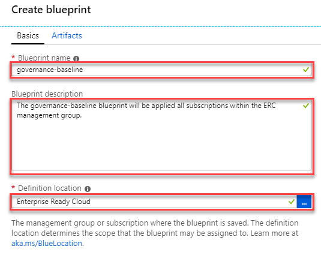

1. Click **Next : Artifacts >>**.

1. Click **+ Add artifact...** and then select **Policy assignment** for the **Artifact type** in the **Add artifact** blade.

    

1. Select the **Require specified tag on resource groups** policy and click **Add**.

    

    > **Note**: In Exercise 2, Azure Policy was used to automatically tag resources as they were created in a resource group, but recall that any tags on the resource group itself were not inherited. Through this blueprint, we will ensure that the *IOCode* and *CostCenter* tags are enforced on each resource group that is created *and* that the tags that are set on the resource group are automatically inherited by any child resources.

1. Click **+ Add artifact...** and then select **Policy assignment** for the **Artifact type** in the **Add artifact** blade.

    

1. Select the **Require specified tag on resource groups** policy and click **Add**.

    

    > **Note**: We need to add two of the same policy definition so we can enforce each tag for *IOCode* and *CostCenter*.

1. Click **+ Add artifact...** and then select **Policy assignment** for the **Artifact type** in the **Add artifact** blade.

    

1. Select the **Append tag and its value from the resource group** policy and click **Add**.

    

1. Click **+ Add artifact...** and then select **Policy assignment** for the **Artifact type** in the **Add artifact** blade.

    

1. Select the **Append tag and its value from the resource group** policy and click **Add**.

    

    > **Note**: We need to add two of the same policy definition so we can ensure each tag for *IOCode* and *CostCenter* is replicated from the resource group to any child resources.

1. Click **+ Add artifact...** and then select **Azure Resource Manager template (Subscription)** for the **Artifact type** in the **Add artifact** blade.

    

1. Complete the form with the following information. This resource group will be used to demonstrate that the policy enacted in our blueprint is working by creating a resource group and then creating a storage account within that resource group.

    - Artifact display name: **BU-RG**

1. In the Template field, paste the following template and click **Add**:

    ```json
    {
        "$schema": "https://schema.management.azure.com/schemas/2018-05-01/subscriptionDeploymentTemplate.json#",
        "contentVersion": "1.0.0.1",
        "parameters": {
            "rgName": {
                "type": "string",
                "metadata": {
                    "description": "The name of the resource group"
                }
            },
            "rgLocation": {
                "type": "string",
                "defaultValue": "eastus",
                "allowedValues": [
                    "eastus",
                    "westus",
                    "northeurope",
                    "westeurope",
                    "japanwest",
                    "japaneast"
                ],
                "metadata": {
                    "description": "The location of the resource group"
                }
            },
            "storagePrefix": {
                "type": "string",
                "maxLength": 11,
                "metadata": {
                    "description": "The prefix for the name of the storage account which will have a unique string appended to it"
                }
            },
            "IOCode": { 
                "type": "string",
                "metadata": {
                    "description": "The value of the IOCode tag that will be applied to the resource group"
                }
            },
            "CostCenter": { 
                "type": "string",
                "metadata": {
                    "description": "The value of the CostCenter tag that will be applied to the resource group"
                }
            }
        },
        "variables": {
            "storageName": "[concat(parameters('storagePrefix'), uniqueString(subscription().id, parameters('rgName')))]"
        },
        "resources": [
            {
                "type": "Microsoft.Resources/resourceGroups",
                "apiVersion": "2018-05-01",
                "location": "[parameters('rgLocation')]",
                "name": "[parameters('rgName')]",
                "tags": {
                    "IOCode": "[parameters('IOCode')]",
                    "CostCenter": "[parameters('CostCenter')]"
                },
                "properties": {}
            },
            {
                "type": "Microsoft.Resources/deployments",
                "apiVersion": "2018-05-01",
                "name": "storageDeployment",
                "resourceGroup": "[parameters('rgName')]",
                "dependsOn": [
                    "[resourceId('Microsoft.Resources/resourceGroups/', parameters('rgName'))]"
                ],
                "properties": {
                    "mode": "Incremental",
                    "template": {
                        "$schema": "https://schema.management.azure.com/schemas/2015-01-01/deploymentTemplate.json#",
                        "contentVersion": "1.0.0.0",
                        "parameters": {},
                        "variables": {},
                        "resources": [
                            {
                                "type": "Microsoft.Storage/storageAccounts",
                                "apiVersion": "2017-10-01",
                                "name": "[variables('storageName')]",
                                "location": "[parameters('rgLocation')]",
                                "kind": "StorageV2",
                                "sku": {
                                    "name": "Standard_LRS"
                                }
                            }
                        ],
                        "outputs": {}
                    }
                }
            }
        ],
        "outputs": {}
    }
    ```

    

    > **Note**: The template parameters will be determined at the time the blueprint is assigned. This allows us flexibility if we need to make a blueprint assignment multiple times and have it maintain a dynamic nature.

1. Save the blueprint as a draft by clicking the **Save Draft** button.

    

### Task 2: Publish a draft blueprint and assign it

In this task, you will publish the previously created blueprint and assign the blueprint to your subscription.

1. In the portal, select **Blueprint definitions** and then the **governance-baseline** blueprint created in the previous step.

    

1. Click **Publish blueprint**.

    

1. Enter a version number (for example *1.0*) in the **Version** field and click **Publish**.

1. Click **Assign blueprint**.

    

1. In the **Assign blueprint** blade, select your target **Subscription**, location (making sure to select a location your previous policy allows such as East US), and then scroll down to the **Artifact parameters** section of the blade.

    

1. Complete the **Artifact parameters** section of the blade with the following:

    - Append tag and its value from the resource group - Tag Name: **IOCode**
    - Append tag and its value from the resource group - Tag Name: **CostCenter**
    - BU-RG
      - rgName: **EnterpriseITRG**
      - rgLocation: **eastus**
      - storagePrefix: **treyrsrch**
      - IOCode: **1000151**
      - CostCenter: **Enterprise IT**
    - Require specified tag on resource groups - Tag Name: **IOCode**
    - Require specified tag on resource groups - Tag Name: **CostCenter**

    

1. Click **Assign**. You will see a notification that the blueprint assignment is being created.

    

1. You will receive an error that blueprint assignment cannot be made as the blueprint resource is disallowed by the *Service catalog* policy that was created in Exercise 1.

### Task 3: Update the Service catalog policy to allow blueprint assignments

1. In the Azure portal, navigate to the Policy service.

1. Select the **Definitions** blade followed by the **Service catalog** policy.

    

1. Click **Edit definition**.

    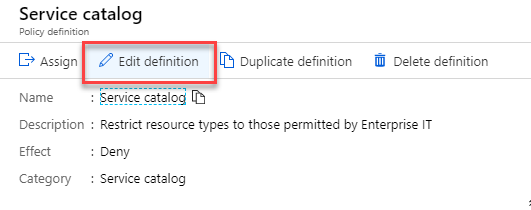

1. Add the following after the `Microsoft.Insights` source and click **Save**.

    ```json
    {
        "source": "action",
        "like": "Microsoft.BluePrint/blueprintAssignments/*"
    }
    ```

    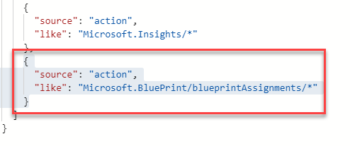

### Task 4: Assign a blueprint

1. In the Azure portal, navigate to the Blueprints service.

1. Select **Blueprint definitions** and then the **governance-baseline** blueprint created in the previous step.

    

2. Click **Assign blueprint**.

    

3. In the **Assign blueprint** blade, select your target **Subscription**, location (making sure to select a location your previous policy allows such as East US), and then scroll down to the **Artifact parameters** section of the blade.

    

4. Complete the **Artifact parameters** section of the blade with the following:

    - Append tag and its value from the resource group - Tag Name: **IOCode**
    - Append tag and its value from the resource group - Tag Name: **CostCenter**
    - BU-RG
      - rgName: **EnterpriseITRG**
      - rgLocation: **eastus**
      - storagePrefix: **treyrsrch**
      - IOCode: **1000151**
      - CostCenter: **Enterprise IT**
    - Require specified tag on resource groups - Tag Name: **IOCode**
    - Require specified tag on resource groups - Tag Name: **CostCenter**

    

5. Click **Assign**. You will see a notification that the blueprint assignment is being created.

    

1. Now that the *Service catalog* policy has been updated, the blueprint assignment will be successful. 

    

1. Click the **Blueprint assignment succeeded** link in the notification to view the status of the blueprint. 

### Task 5: Verify blueprint policy and resource creation

1. In the Azure portal, select **Resource groups** followed by the **EnterpriseITRG** resource group.

    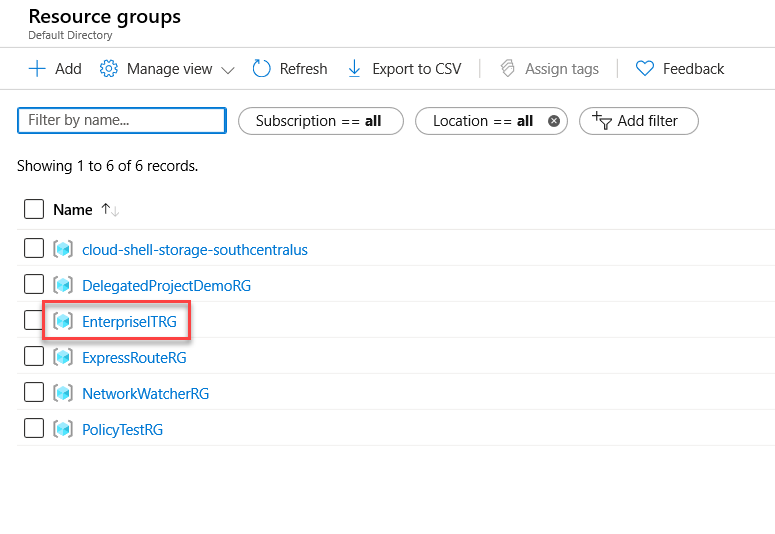

2. Note that both the *IOCode* and *CostCenter* tags have been applied to the resource group. The application of these tags was done through the Azure Resource Manager template that was an artifact within the blueprint assignment.

    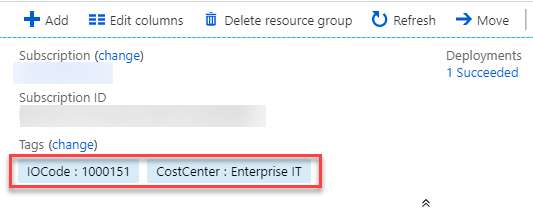

1. Next, select the storage account prefixed with *treyrsrch*.

1. In the **Overview** pane, note the tags for *IOCode* and *CostCenter* have been inherited from the parent resource group. These tags were not a part of the Azure Resource Manager template and are a product of the Azure Policy artifacts in the blueprint.

    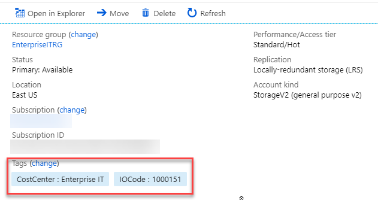

## After the hands-on lab 

Duration: 10 minutes

After completing the hands-on lab, you will remove the policies on your subscription.

### Task 1: Remove resources and configuration created during this lab

1. Log in to the Azure portal.

2. Navigate to the **Policy** blade.

3. Select **Assignments**, and delete all policy assignments created during this lab.

4. Select **Definitions**, and delete any policy definitions or initiative definitions created during this lab.

5. Navigate to the **Blueprints** blade. 

6. Remove any blueprint assignments and any blueprints created during this lab.

7. Navigate to the **Management Groups** blade.

8. Remove any Management Groups crated during this lab.

8. Navigate to the **Resource Groups** blade.

9.  Remove any resource groups created during this lab. This will also delete any resources in those resource groups.

10. Navigate to the **Azure Active Directory** blade.

11. Remove any users and groups created during this lab.

You should follow all steps provided *after* attending the Hands-on lab.