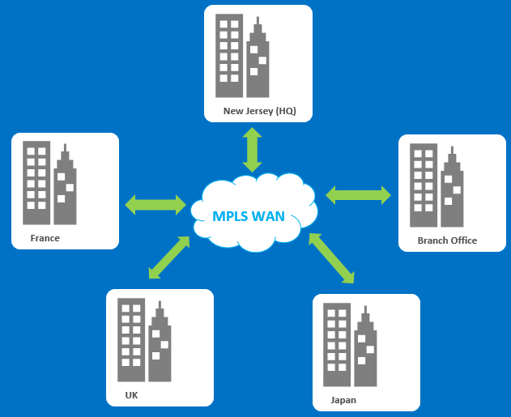
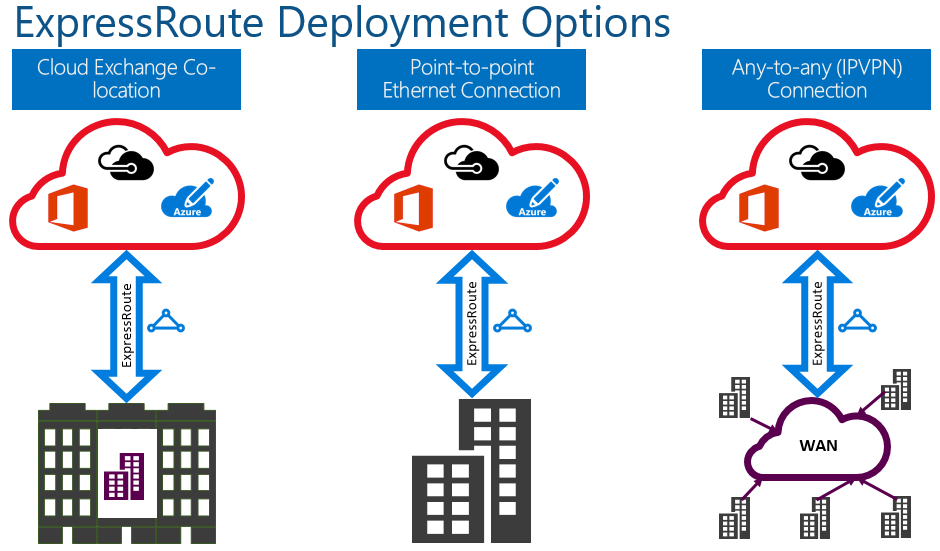
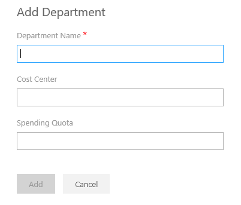
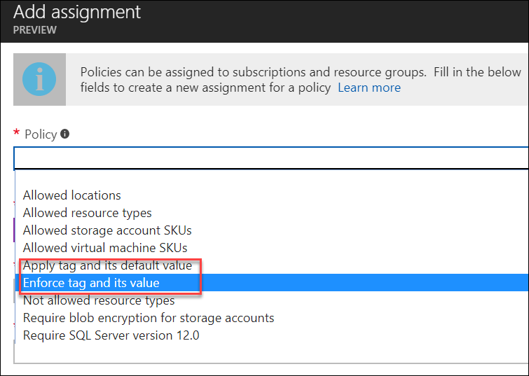
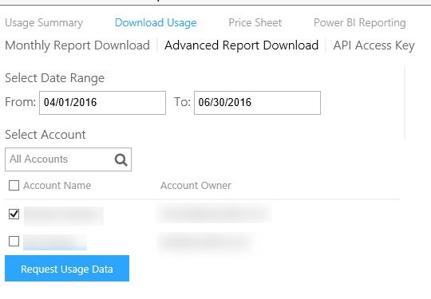
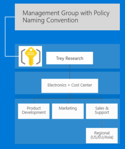
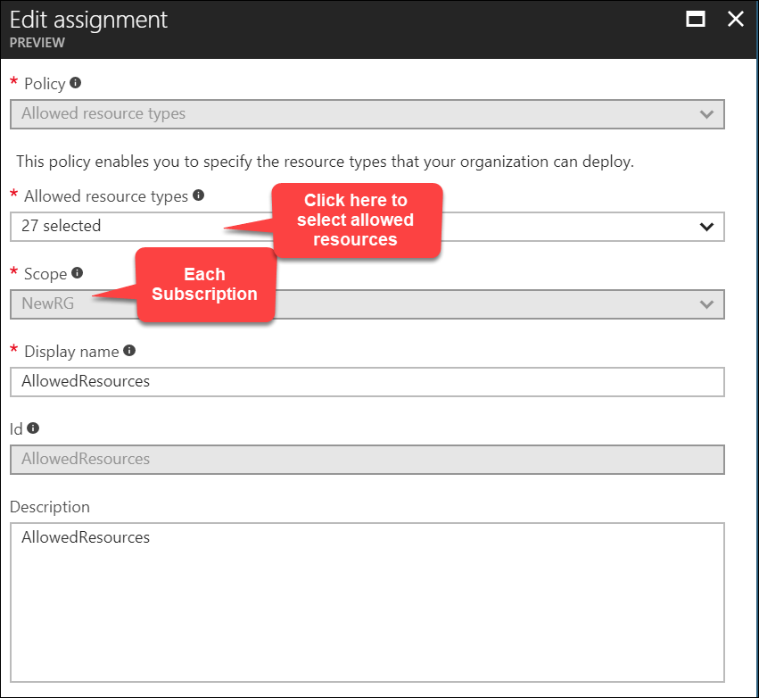
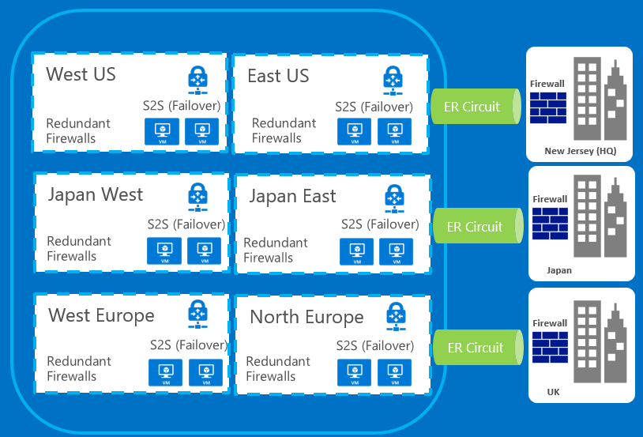
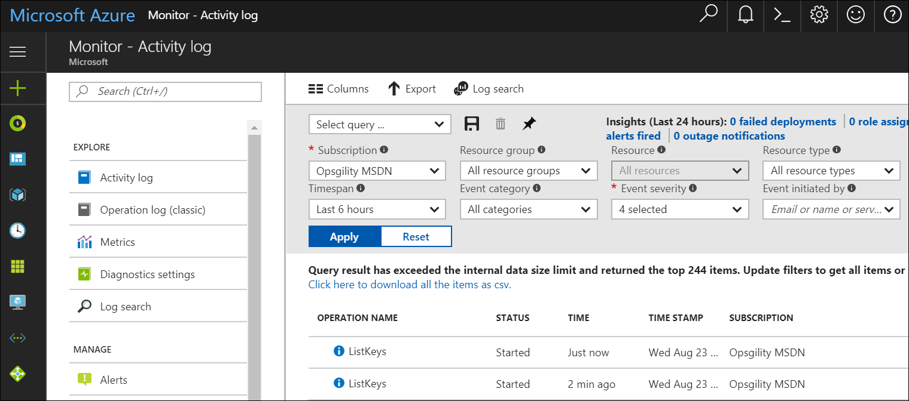

# Enterprise-ready cloud

## Whiteboard design session trainer guide

## March 2018

Information in this document, including URL and other Internet Web site references, is subject to change without notice. Unless otherwise noted, the example companies, organizations, products, domain names, e-mail addresses, logos, people, places, and events depicted herein are fictitious, and no association with any real company, organization, product, domain name, e-mail address, logo, person, place or event is intended or should be inferred. Complying with all applicable copyright laws is the responsibility of the user. Without limiting the rights under copyright, no part of this document may be reproduced, stored in or introduced into a retrieval system, or transmitted in any form or by any means (electronic, mechanical, photocopying, recording, or otherwise), or for any purpose, without the express written permission of Microsoft Corporation.

Microsoft may have patents, patent applications, trademarks, copyrights, or other intellectual property rights covering subject matter in this document. Except as expressly provided in any written license agreement from Microsoft, the furnishing of this document does not give you any license to these patents, trademarks, copyrights, or other intellectual property.

The names of manufacturers, products, or URLs are provided for informational purposes only and Microsoft makes no representations and warranties, either expressed, implied, or statutory, regarding these manufacturers or the use of the products with any Microsoft technologies. The inclusion of a manufacturer or product does not imply endorsement of Microsoft of the manufacturer or product. Links may be provided to third party sites. Such sites are not under the control of Microsoft and Microsoft is not responsible for the contents of any linked site or any link contained in a linked site, or any changes or updates to such sites. Microsoft is not responsible for webcasting or any other form of transmission received from any linked site. Microsoft is providing these links to you only as a convenience, and the inclusion of any link does not imply endorsement of Microsoft of the site or the products contained therein.

2018 Microsoft Corporation. All rights reserved.

Microsoft and the trademarks listed at <https://www.microsoft.com/en-us/legal/intellectualproperty/Trademarks/Usage/General.aspx> are trademarks of the Microsoft group of companies. All other trademarks are property of their respective owners.

# Contents

[Trainer information](#trainer-information)

[Enterprise-ready cloud whiteboard design session student guide](#enterprise-ready-cloud-whiteboard-design-session-student-guide)

[Abstract and learning objectives](#abstract-and-learning-objectives)

[Step 1: Review the customer case study](#step-1-review-the-customer-case-study)

[Step 2: Design a proof of concept solution](#step-2-design-a-proof-of-concept-solution)

[Step 3: Present the solution](#step-3-present-the-solution)

[Wrap-up](#wrap-up)

[Additional references](#additional-references)

[Enterprise-ready cloud whiteboard design session trainer guide](#enterprise-ready-cloud-whiteboard-design-session-trainer-guide)

[Step 1: Review the customer case study](#step-1-review-the-customer-case-study-1)

[Step 2: Design a proof of concept solution](#step-2-design-a-proof-of-concept-solution-1)

[Step 3: Present the solution](#step-3-present-the-solution-1)

[Wrap-up](#wrap-up-1)

[Preferred target audience](#preferred-target-audience)

[Preferred solution](#preferred-solution)

[Checklist of preferred objection handling](#checklist-of-preferred-objection-handling)

[Customer quote (to be read back to the attendees at the end)](#customer-quote-to-be-read-back-to-the-attendees-at-the-end)

# Trainer information

Thank you for taking time to support the whiteboard design sessions as a trainer!

#### Role of the trainer

An amazing trainer:

-   Creates a safe environment in which learning can take place.

-   Stimulates the participant's thinking.

-   Involves the participant in the learning process.

-   Manages the learning process (on time, on topic, and adjusting to benefit participants).

-   Ensures individual participant accountability.

-   Ties it all together for the participant.

-   Provides insight and experience to the learning process.

-   Effectively leads the whiteboard design session discussion.

-   Monitors quality and appropriateness of participant deliverables.

-   Effectively leads the feedback process.

#### Whiteboard design session flow 

Each whiteboard design session uses the following flow:

**Step 1: Review the customer case study (15 minutes)**

Outcome: Analyze your customer's needs

-   Customer's background, situation, needs and technical requirements

-   Current customer infrastructure and architecture

-   Potential issues, objectives and blockers

**Step 2: Design a proof of concept solution (60 minutes)**

Outcome: Prepare to present a solution for your target customer audience

-   Determine your target customer audience

-   Determine customer's business needs to address your solution

-   Design and diagram your solution

-   Prepare to present your solution

**Step 3: Present the solution (30 minutes)**

Outcome: Present solution to your customer

-   Present solution

-   Respond to customer objections

-   Receive feedback

**Wrap-up (15 minutes)**

-   Review preferred solution

#### Before the whiteboard design session: How to prepare

Before conducting your first whiteboard design session:

-   Read the Student guide (including the case study) and Trainer guide

-   Become familiar with all key points and activities.

-   Plan the point you want to stress, which questions you want to drive, transitions, and be ready to answer questions.

-   Prior to the whiteboard design session, discuss the case study to pick up more ideas.

-   Make notes for later.

#### During the whiteboard design session: Tips for an effective whiteboard design session

**Refer to the Trainer guide** to stay on track and observe the timings.

**Do not expect to memorize every detail** of the whiteboard design session.

When participants are doing activities, you can **look ahead to refresh your memory**.

-   **Adjust activity and whiteboard design session pace** as needed to allow time for presenting, feedback, and sharing.

-   **Add examples, points, and stories** from your own experience. Think about stories you can share that help you make your points clearly and effectively.

-   **Consider creating a "parking lot"** to record issues or questions raised that are outside the scope of the whiteboard design session or can be answered later. Decide how you will address these issues, so you can acknowledge them without being derailed by them.

***Have fun**! Encourage participants to have fun and share!*

**Involve your participants.** Talk and share your knowledge but always involve your participants, even while you are the one speaking.

**Ask questions** and get them to share to fully involve your group in the learning process.

**Ask first**, whenever possible. Before launching into a topic, learn your audience's opinions about it and experiences with it. Asking first enables you to assess their level of knowledge and experience and leaves them more open to what you are presenting.

**Wait for responses**. If you ask a question such as, "What's your experience with (fill in the blank)?" then wait. Do not be afraid of a little silence. If you leap into the silence, your participants will feel you are not serious about involving them and will become passive. Give participants a chance to think, and if no one answers, patiently ask again. You will usually get a response.

#  Enterprise-ready cloud whiteboard design session student guide

## Abstract and learning objectives 

Create an Azure cloud governance plan to advise a manufacturing company of the features available in Azure. Discover features to bring governance to their Azure deployments, distributed administration, and allowance for secure remote connectivity and development work for their offshore developers.

Attendees will be better able to design a governance plan to showcase the security and governance features of Azure and control costs. In addition,

-   Provide for cost tracking by business unit, environment, and project

-   Provide for a distributed administration model

-   Put a service catalog in place to prevent deployment of unsupported Azure services

-   Put controls in place to allow deployment of services only in specific regions

## Step 1: Review the customer case study 

**Outcome**

Analyze your customer's needs.

#### Facilitator/subject matter expert (SME) presentation of customer case study 

Duration: 15 minutes

Directions: With all participants in the session, the facilitator/SME presents an overview of the customer case study along with technical tips.

1.  Meet your table participants and trainer.

2.  Read all the directions for Steps 1--3 in the Student guide.

3.  As a table team, review the following customer case study.

#### Customer situation

Trey Research is a manufacturing company that builds consumer products with 29.6 billion USD in annual revenue. Trey's headquarters are in New Jersey, but they have data centers and branch offices scattered across the United States with several major offices in the United Kingdom, France, and Japan.

Even as large as it is, Trey seeks to maximize the cost-effectiveness and flexibility of its IT, especially in new projects and business units. With a dizzying number of existing business units, each with their own unique requirements from IT and ballooning costs from internal hardware and data center investment, Trey is looking to the cloud.

Trey is interested in a large-scale solution that will help mitigate creeping costs and start the transition to a modern cloud-based enterprise architecture.

Trey's technical leadership has decided to move forward with a Microsoft enterprise agreement (EA) with a heavy commitment in Microsoft Azure. Ken Greenwald, Trey Research's CTO, is aware of the potential for the cloud, but also has a keen understanding that without strong architectural guidance, Trey may end up with a sub-optimal deployment that is difficult to support. These incorrect practices can then be disbursed across the enterprise. Ken wants to start on the right foot by focusing on best practices from the start.

To kick off planning for integrating Azure into their environment, Ken introduced you to several directors within Trey Research's Enterprise IT group that have been part of the initial Azure planning process.

Enterprise IT is responsible for managing corporate network connectivity, datacenter distribution, capacity planning, identity, and enterprise wide SaaS services for Trey Research employees. Enterprise IT is also responsible for supporting the services and datacenters and setting auditing policy on hardware and services.

*Subscription organization and chargeback*

This table is a partial view of Trey Research's organization. Each rectangle represents a business unit and subunits within the business unit. Each of which has IT resources with an assigned budget/quota that will be able to consume Azure for related IT services.

Enterprise IT will be responsible for providing access to Azure for users in each individual business unit and tracking their Azure usage costs at the department and subscription level by the business unit's cost center.

Within a business unit, each new project should track its consumption using a specific tag for its IO code within the business unit.

Each business unit has a requirement to break down their costs into multiple categories so business managers in finance can analyze for spending patterns.

-   Development and Test

-   Production

-   Support Services

-   Infrastructure

Business units and the finance department need a cost management dashboard to more easily identify current cost and anomalous spending to better manage their Azure spend.

*Supported services and delegated access control*

With a company the size of Trey Research, providing the ability to delegate permissions to different administrators at the business unit level is critical. At this point, Trey Research has deployed Office 365 and it is configured with federated access to their ADFS servers and their EA has been created within the same organization.

Each business unit and sub-business unit has their own unique IT needs. IT has identified a list of services within Azure that they are willing to support and are interested in options for controlling access to unsupported services throughout the organization.

-   Virtual machines

-   ExpressRoute

    -   The ExpressRoute circuit(s) will be created and managed by IT, but IT wants to ensure that sub-business units should be able to use the circuits, but not create new ones or change the existing circuits.

-   VPN gateways

-   Storage

-   Virtual networks

-   Backup

-   Site recovery

-   DevTest labs

-   Web Apps

-   SQL Database

For each new project, a user in the business unit should be allowed to have rights for managing his or her team by having the ability to add or remove users and allow them to create resources in the subscription.

*Connectivity*

At a high level, Trey Research is connected globally using an existing MPLS wide area network. There are several smaller offices that are connected via site-to-site VPN.

Enterprise IT understands that ExpressRoute is likely going to be the correct connectivity solution. However, they are unsure what they need to consider from a security perspective or for availability. Typically, they protect their perimeter network with firewalls. Is that needed with ExpressRoute and if so, what would they need to do to implement it? How does ExpressRoute implement redundancy? What should they be looking for when they talk to an ExpressRoute partner? Finally, for the sites that are not part of the WAN, how would they connect to resources in Azure?

*Availability *

There are several Internet and intranet-facing web-based workloads that are considered critical to the business. These workloads typically use SQL Server and several use MySQL. With that in mind, Trey Research is recommending to business units to design those applications by deploying across multiple regions, or if that type of architecture is not feasible, to fail-back to on-premises in the event of a failure.

This list is a list of primary and secondary regions IT will support for these scenarios.

-   Primary: East United States, Fail over: South Central United States

-   Primary: West Europe, Fail over: North Europe

-   Primary: Japan West, Fail over Japan East

Trey Research would like to know if this list makes sense, if there is any guidance from Microsoft on building geo-redundant solutions across multiple data centers, and what other factors they should consider.

*Security and accident protection *

If a service has an outage, it is important to know the chain of events that led up to the outage and who (if anyone) caused it. Additionally, Trey wants to ensure that production workloads cannot be accidently deleted by administrators getting confused over a test workload versus production. Trey Research are also concerned about how to ensure their VMs meet Azure security best practices and would like to ensure Production workloads are protected even in the event their security perimeter is compromised.

*E-commerce developer team*

The e-commerce team is owned by the Enterprise IT team and is responsible for building and maintaining the corporate website where consumers and channel partners can order products directly from Trey Research. The e-commerce site and order fulfillment system is currently hosted on Apache and Red Hat Enterprise Linux.

This team has a significant percentage of developers that are contingent staff. Often these contingent staff members will come onboard for a short term to implement a new feature that the core team does not have the skills or resources to tackle. Currently, the e-commerce team is bringing resources onsite for this work, due to not having a secure remote access solution. Providing hardware resources and access to the development environment is a challenge due to the constant turnover of contingent staff. The time needed to provide an environment is disproportionally long relative to the amount of time the developer is there. This is because each developer must provision a set of services.

#### Customer needs 

1.  Provide access to create and manage new workloads in Azure for various business units.

2.  Identify connectivity requirements with ExpressRoute access control and availability.

3.  Implement a charge back for the business units for resources they consume while allowing each business unit to monitor their own usage.

4.  Apply governance to business units to control what can be created.

5.  Implement delegated access control for new projects within business unit subscriptions.

6.  Implement a common resource naming standard across the organization.

7.  The above governance controls must be implemented with minimum per-subscription configuration overhead, and compliance with these controls must be auditable to detect any out-of-compliance usage.

8.  Identify a top-level strategy for building geo-redundant solutions.

9.  Identify how Trey Research can track changes to the Azure-based deployments and prevent accidental deletion of resources.

10. Identify a solution of providing remote access to e-commerce team contingent staff.

11. Increase agility to speed up the on-boarding of resources to make the e-commerce team contingent staff productive more quickly.

12. Ensure full-time and contingent staff for e-commerce have access to what they need, but no more.

#### Customer objections 

1.  We need the ability to split our Azure bill by business unit and even workload classification. Can Azure support this requirement? How can we analyze our bill for cost optimization and charge back?

2.  As well as implementing our governance rules on how Azure is used, we need a way to audit that no deployments have been made that bypass those roles.

3.  Security is important to us. We have evaluated Network Security Groups and our security team does not feel they offer the same level of security that we enjoy with our on-premises firewall-based solutions (Examples: intrusion and malware detection).

4.  Delegating control to business units is incredibly important to Trey Research. At our scale, a single team cannot possibly manage all the needs of the business. Corporate IT requires the ability to set policy at the enterprise level and still needs a detailed level of control. How can Azure address these needs?

5.  Trey Research currently monitors their on-premises workloads using SCOM. A small business unit experimented with running virtual machines in AWS and the monitoring team was not thrilled with a completely different system for monitoring for availability. Does Azure have the same problem?

6.  How can we ensure our deployments meet Azure security best practices, and how can we protect our Production workloads even if the security perimeter is compromised?

7.  How can Azure help control the costs associated with non-Production VMs left running out-of-hours?

#### Infographic for common scenarios

 and RM Policies")

## Step 2: Design a proof of concept solution

**Outcome **

Design a solution and prepare to present a solution to the target customer audience in a 15-minute chalk-talk format.

Duration: 60 minutes

**Business needs**

Directions: With all participants at your table, answer the following questions and list the answers on a flip chart.

1.  Who should you present this solution to? Who is your target customer audience? Who are the decision makers?

2.  What customer business needs do you need to address with your solution?

**Design **

Directions: With all participants at your table, respond to the following questions on a flip chart.

*Subscription organization and charge back *

1.  Diagram how you would suggest organizing the Azure EA portal for Trey Research to allow access to Azure.

2.  How can Enterprise IT assign a spending quota to each business unit and monitor spending for each business unit's cost center? What happens if the business unit exceeds their assigned quota?

3.  How can individual business units monitor their Azure spending?

4.  Within a business unit, costs for each project should be tracked independently based on the IO code for that specific project. How can per project tracking be implemented? How would you implement cost management reporting and alerting?

5.  How can Enterprise IT enforce a company-wide resource naming convention?

6.  How can Enterprise IT minimize per-subscription configuration and centrally audit compliance with their governance rules?

7.  How can Azure help Business Units minimize wasted spend on non-Production VMs left running out-of-hours?

*Supported services and delegated access control *

1.  Identify a solution to restrict which services can be created and used in each business unit subscription. Diagram specifically how your solution would be put into place and perform a requirements analysis to determine if there are services needed that Trey Research has not added to their initial list. This solution should allow access to the following services by default, but no others.

    -   Virtual machines

    -   ExpressRoute

        -   The ExpressRoute circuit(s) will be created and managed by IT, however IT wants to ensure that business units are able to use the circuits, but not create new ones or change the existing circuits.

    -   VPN gateways

    -   Storage

    -   Virtual networks

    -   Backup

    -   Site recovery

    -   DevTest labs

    -   Log analytics

    -   Web Apps

    -   SQL Database

2.  One or more users from the business unit must have the permissions to create resources in the subscription and view all resources. The user should not have the ability to change policies set by Enterprise IT.

3.  How would you assign permission to users and groups?

4.  Could we allow users from partner organizations to access corporate applications?

5.  Is there another way to limit access to services in Azure using templates?

6.  For each project in Azure, the business unit administrator must have permissions to add or remove users, allow them to create resources, or even apply additional policies for resources in that project. Diagram at a high level how this would be achieved and provide some pseudo code that would be needed to accomplish the task.

*Connectivity *

1.  Diagram at a high level how an ExpressRoute deployment for Trey Research should be configured for high availability.

2.  Walk through the steps that Trey Research would have to perform to enable other subscriptions to use ExpressRoute.

3.  From the security perspective, how could Trey Research deploy firewalls to protect their network after ExpressRoute is deployed? What network features are required and where would the firewalls be deployed? Diagram your solution.

4.  For branch office sites that do not connect back to the WAN, how could they connect to Azure? Could Azure also be used to route traffic to different on-premises sites instead of their current site-to-site connections?

*Availability *

1.  Evaluate the list of proposed regions and provide guidance on what policies are in place by Microsoft to help customers design a geo-redundant solution.

2.  Explain how Trey Research could restrict services to just the supported regions.

3.  Diagram at a high level what a geo-redundant solution would look like for a public facing web application with a backend that uses SQL Server. What about a private facing web application?

4.  For workloads within the same region, how could they ensure their virtual machines are available in the event of a physical server failure or a host update?

*Security and accident protection *

1.  What would you recommend to Trey Research on how to mitigate accidently deleting production workloads? If that were to happen, what would the proper procedure be to identify who deleted the resource?

How can we ensure our deployments meet Azure security best practices, and how can we protect our Production workloads even in the event that the security perimeter is compromised?*E-commerce developer team*

1.  Identify a solution to provide access to a development environment that would be suitable for contingent staff for the e-commerce team.

    -   What steps are needed to allow access to the environment?

    -   What would be needed to automate the environment to speed up onboarding?

    -   What options could you propose to allow access for remote employees? Specifically, how could they access resources on the ECommerceDev network but nothing else on the Azure network?

**Prepare**

Directions: With all participants at your table:

1.  Identify any customer needs that are not addressed with the proposed solution.

2.  Identify the benefits of your solution.

3.  Determine how you will respond to the customer's objections.

Prepare a 15-minute chalk-talk style presentation to the customer.

## Step 3: Present the solution

**Outcome **

Prepare to present a solution to the target customer audience in a 15-minute chalk-talk format.

**Presentation **

Duration: 30 minutes

**Directions**

1.  Pair with another table.

2.  One table is the Microsoft team and the other table is the customer.

3.  The Microsoft team presents their proposed solution to the customer.

4.  The customer makes one of the objections from the list of objections.

5.  The Microsoft team responds to the objection.

6.  The customer team gives feedback to the Microsoft team.

7.  Tables switch roles and repeat Steps 2--6.

##  Wrap-up 

Duration: 15 minutes

-   Tables reconvene with the larger group to hear a SME share the preferred solution for the case study.

##  Additional references

|    |            |
|----------|:-------------:|
|Videos on the Azure EA Portal | <https://channel9.msdn.com/blogs/EA.Azure.com> |
|EA Portal Roles  |  <http://www.redbaronofazure.com/?cat=111>|
|Azure Policy| <https://docs.microsoft.com/azure/azure-policy/azure-policy-introduction>|
|Azure Policy Initiatives | https://docs.microsoft.com/azure/azure-policy/azure-policy-introduction\#initiative-definition|
|Role Based Access Control Configuration|<https://docs.microsoft.com/azure/active-directory/role-based-access-control-configure> |
|Built in Roles for RBAC  | <https://docs.microsoft.com/azure/active-directory/role-based-access-built-in-roles>|
|Custom Roles for RBAC| <https://docs.microsoft.com/azure/active-directory/role-based-access-control-custom-roles>|
|Management Groups   |<https://docs.microsoft.com/azure/azure-resource-manager/management-groups-overview> |
|Virtual Networks User Defined Routes  | <https://docs.microsoft.com/azure/virtual-network/virtual-networks-udr-overview >|
|Azure Traffic Manager  | <https://docs.microsoft.com/azure/traffic-manager/> |
|ExpressRoute FAQ   | <https://azure.microsoft.com/en-us/documentation/articles/expressroute-faqshttps://docs.microsoft.com/azure/expressroute/expressroute-faqs](https://docs.microsoft.com/azure/expressroute/expressroute-faqs> |
|SQL Server in Azure Virtual Machines with High Availability  | https://docs.microsoft.com/azure/virtual-machines/virtual-machines-windows-sql-high-availability-dr?toc=%2fazure%2fvirtual-machines%2fwindows%2ftoc.json|
|Azure Active Directory B2B collaboration | <https://docs.microsoft.com/azure/active-directory/active-directory-b2b-what-is-azure-ad-b2b> |
|Azure Cost Management by Cloudyn | <https://docs.microsoft.com/en-us/azure/cost-management/overview>|
|Azure Security Center | <https://docs.microsoft.com/azure/security-center/security-center-intro>|
|Auto-shutdown of VMs   |<https://azuremarketplace.microsoft.com/marketplace/apps/Microsoft.StartStopVMSolution?tab=Overview>|

# Enterprise-ready cloud whiteboard design session trainer guide

## Step 1: Review the customer case study

-   Check in with your table participants to introduce yourself as the trainer.

-   Ask, "What questions do you have about the customer case study?"

-   Briefly review the steps and timeframes of the whiteboard design session.

-   Ready, set, go! Let the table participants begin.

## Step 2: Design a proof of concept solution

-   Check in with your tables to ensure that they are transitioning from step to step on time.

-   Provide some feedback on their responses to the business needs and design.

    -   Try asking questions first that will lead the participants to discover the answers on their own.

-   Provide feedback for their responses to the customer's objections.

    -   Try asking questions first that will lead the participants to discover the answers on their own.

## Step 3: Present the solution

-   Determine which table will be paired with your table before Step 3 begins.

-   For the first round, assign one table as the Microsoft team and the other table as the customer.

-   Have the Microsoft team present their solution to the customer team.

    -   Have the customer team provide one objection for the Microsoft team to respond to.

    -   The presentation and objections should be no longer than 10-minutes.

<!-- -->

-   Have participants on the customer team give feedback to the Microsoft team.

    -   The feedback should be no longer than 5 minutes.

    -   If needed, the trainer may also provide feedback.

## Wrap-up

-   Have the table participants reconvene with the larger session group to hear a SME share the following preferred solution.

##  Preferred target audience

-   Ken Greenwald, CTO

-   Enterprise IT directors

-   Business unit technical leads within Enterprise IT

-   EA portal administrators

## Preferred solution

*Subscription organization and chargeback*

-   **Design:** Diagram how you would suggest organizing the Azure EA portal for Trey Research to allow access to Azure.

-   **Solution:** Each business unit of Trey Research would have a department created in the Azure EA portal with one or more department administrators and account owners from Enterprise IT assigned. Enterprise IT would own the end-to-end experience of creating subscriptions to ensure that correct policies are in place and stay in place.

-   **Design:** How can Enterprise IT assign a spending quota to each business unit and monitor spending for each business unit's cost center? What happens if the business unit exceeds their assigned quota?

-   **Solution:** Each department should have a cost center assigned and the associated spending quota set by Enterprise IT. Notification emails are sent as different percentage levels of the quota are reached.

    

-   **Design:** How can individual business units monitor their Azure spending?

-   **Solution:** Enterprise Admins can use the Azure EA portal (<https://ea.azure.com>) to view at a high-level, usage by department, account, or subscription by default.

    

    Enterprise admins can also grant access to department admins or account owners to view usage data.

    

    The business unit users could also login to the Azure Management Portal (<https://portal.azure.com>) and see the current consumption of their subscription's Azure usage broken down by resource group (if the user has access to the resources).

-   **Design:** Within a business unit, costs for each project should be tracked independently based on the IO code for that specific project. How can per project cost tracking be implemented?

-   **Solution:** Each new project should be deployed into one or more resource groups. Create an ARM policy that applies to the resource groups, that will append the IO code tag to resources as they are created. This allows for reporting at the project-level, based on the tag (expenses can be grouped by tag).

> {
>
> \"if\": {
>
> \"not\": {
>
> \"anyOf\": \[
>
> {
>
> \"source\": \"action\",
>
> \"like\": \"Microsoft.Resources/\[ProjectResourceGroup\]/\*\"
>
> }
>
> \]
>
> }
>
> },
>
> \"then\": {
>
> \"effect\": \"append\",
>
> \"details\": \[
>
> {
>
> \"field\": \"tags\",
>
> \"value\": { \"ioCode\": \"\[IOCODEVALUE\]\" }
>
> }
>
> \]
>
> }
>
> }
>
> Alternatively, separate subscriptions could be used for each project, and the above ARM policy applied at the subscription level.

-   **Design:** How could you enforce the cost tracking of cloud deployments within business units, according to the following taxonomies?

    -   Development and Test

    -   Production

    -   Support Services

    -   Infrastructure

-   **Solution:** To enforce a taxonomy that would group resource costs by the following categories, each new subscription would need an ARM policy assigned that enforced resource groups to have a tag with one of the following values assigned.

    -   Tag Name: Environment---Value: Development and Test

    -   Tag Name: Environment---Value: Production

    -   Tag Name: Environment---Value: Support Services

    -   Tag Name: Environment---Value: Infrastructure

> This can be done with built in policies, specifically by applying the **Apply tag and its default value** and the **Enforce tag and its value** policies. A new resource group would be created for each environment (Production, Dev, etc.) and these policies would be applied, specifying the tags to assign.
>
> 

-   To view detailed information grouped by resource group or tags, the user would click the Download Usage link in the Azure EA portal, select the accounts and dates and request the usage data. A detailed .csv will be generated with a column for resource groups and tags.

> 

-   Azure Cost Management by Cloudyn can be used for cost management reporting and alerting.

    -   To do this you must register with Cloudyn from the Azure Portal

    -   Create a hierarchy of cost entities in Cloudyn representing different business units and the various taxonomy.

        -   Choose appropriate access levels for each subscription in your EA.

        -   Assign each subscription to the appropriate cost entity.

    -   Create users for business units and the finance department.

> 

-   **Design:** How can Enterprise IT enforce a company-wide resource naming convention?

-   **Solution:** A naming convention can be implementing using Azure Policy to restrict the names of each resource created.

    {

    \"if\": {

    \"allOf\": \[

    {

    \"field\": \"type\",

    \"equals\": \"Microsoft.Compute/virtualMachines\"

    },

    {

    \"not\": {

    \"field\": \"name\",

    \"like\": \"\*-vm\"

    }

    }

    \]

    },

    \"then\": {

    \"effect\": \"deny\"

    }

    }

-   The above example shows how to enforce a simple naming constraint on a single resource type---virtual machines. Enterprise IT need to enforce their convention across all their resource types. Implementing this in a single policy requires an impractically-large conditional logic in the policy rule.

-   Instead, separate policies should be created for each resource type. These policies should then be combined into a single *policy initiative.* Using a policy initiative allows the entire set of policies to be assigned in a single operation. It also allows new naming rules to be added easily---simply add the new rule to the initiative and it will be applied across all existing assignments.

-   **Design:** How can Enterprise IT minimize per-subscription configuration and centrally audit compliance with their governance rules?

-   **Solution:** To minimize subscription-level configuration, subscriptions should be grouped into a management group hierarchy, managed by Enterprise IT. This hierarchy should reflect the business unit structure.

    Enterprise IT should then apply Azure policies used for governance at the appropriate management group level. For example, since the naming convention policy initiative is to be used company wide, it need only be applied once, at the tenant root management group. It will then be inherited by all subscriptions in the organization, including new subscriptions, without any per-subscription configuration.

    

    Using the Standard policy tier enables Azure to generate a compliance report, showing which resources in the scope of a given policy are out of compliance (do not meet the policy rule condition) of the policy.

    -   In the case of the naming convention policy, since this is applied at the root tenant management group level, this allows Enterprise IT to easily see which resources are not following the naming convention, company-wide.

    -   In the case of the policy to enforce Environment tags, the policy discussed earlier uses different tag values for different projects, hence the policy is not applied at the root tenant management group level, but instead at the level of individual subscriptions or resource groups. A separate policy should be created to verify that the Environment tag is in place and uses one of the permitted values. This policy can be applied at the root tenant management group level. This will both enforce that all resources in all subscriptions include the Environment (even if a project-level rule is forgotten), and also provide a single compliance audit report. An example policy is given below.

        {

        \"if\": {

        \"not\": {

        \"allOf\": \[

        {

        \"field\": \"tags\",

        \"containsKey\": \"Environment\"

        },

        {

        \"field\": \"Environment",

        \"in\": \[\"Development and Test","Production","Support Services","Infrastructure"\]

        }

        \]

        }

        },

        \"then\": {

        \"effect\": \"audit\"

        }

        }

        A similar policy can be used to enforce and audit use of other company-wide tags, such as ioCode.

<!-- -->

-   **Design:** How can Azure help business units minimize wasted spend on non-production VMs left running out-of-hours?

-   **Solution:** Azure offers a number of features to minimize wasted spend on non-Production VMs:

    -   For Dev/Test scenarios, Azure Dev/Test Labs enables the full lifecycle of Dev/Test environments to be managed, including hours of use, and policies on the number and size of VMs per user and per lab.

    -   Each VM can be configured with a time at which it will automatically shut down until restarted. This is available in the management portal when creating the VM, or afterwards. This feature was originally part of Dev/Test Labs and is now available for all VMs.

    -   The 'Start/Stop VMs during off-hours' offering in the Azure Marketplace also offers the ability to automatically configure when VMs will run. This solution has the advantage that a single configuration can be applied across a subscription (selectively if necessary), rather than being applied to each individual VMs. It also has the ability to schedule VM start time as well as stop time. It could potentially be extended to auto-shutdown VMs based on their Environment tag.

    -   Azure Cost Management (by Cloudyn) offers reports showing VM utilization and recommendations for stopping idle VMs and right-sizing under-utilized VMs.

**Azure EA role descriptions**

**Enterprise admin**

Can add other enterprise or department administrators, add departments, add or associate accounts to the enrollment, can view usage and charges data across all accounts and subscriptions, can view the monetary commitment balance associated to the enrollment. There is no limit to the number of enterprise administrators on an enrollment.

**Department admin**

Can edit their department name and cost center, manage department admins, add accounts to their enrollment and their departments, remove accounts from their departments, and view department charges if enabled by the enterprise admin.

**Account owner**

Can add subscriptions to the account, update the service administrator and co-administrator for an individual subscription, view usage data for their account, and view account charges if enabled by the enterprise administrator. The account owner will not have visibility of the monetary commitment balance unless they also have enterprise administrator rights.

*Supported services and delegated access control*

-   **Design:** Identify a solution to restrict which services can be created and used in each business unit subscription. Diagram specifically how your solution would be put into place and perform a requirements analysis to determine if there are services needed that Trey Research has not added to their initial list. This solution should allow access to these services by default, but no others.

    -   Virtual machines

    -   ExpressRoute

        -   The ExpressRoute circuit(s) will be created and managed by IT, but IT wants to ensure that sub-business units should be able to use the circuits, but not create new ones or change the existing circuits.

    -   VPN gateways

    -   Storage (standard and premium)

    -   Virtual networks

    -   Backup

    -   Site recovery

    -   DevTest labs

    -   Log analytics

    -   Web App

    -   SQL Database

-   **Solution:** Enterprise IT should apply two Azure Policies. The first will be the built-in policy **Allowed Resource Types**. They will choose each resource type required for the services the customer requires.

The second policy will be a custom policy to restrict the creation of ExpressRoute circuits, but allow existing circuits to be linked to virtual networks.

**Service catalog policy to restrict ExpressRoute**

> {
>
> \"if\": {
>
> \"source\": \"action\",
>
> \"equals\": \"Microsoft.Network/expressRouteCircuits/write\"
>
> },
>
> \"then\": {
>
> \"effect\": \"deny\"
>
> }

}

Prior to the addition of Management Groups, it would have been necessary to apply these policies on every subscription in the organization. This is an administrative burden---it can be automated, but this still leaves scopes for non-compliance in case for some reason a subscription is created without the policy being applied.

Management Groups give a better solution. The policies can instead be applied to the tenant root management group. With this single step, the policies are effective across every subscription in the organization, and are also effective on all new subscriptions without any additional steps being taken.

There's one catch---the Enterprise IT team will need a subscription in which to host the ExpressRoute circuits used by the rest of the organization. A policy applied to the root tenant management group preventing creation of ExpressRoute circuits would also block these planned Enterprise IT circuits. Fortunately, Azure supports 'exception paths' when applying policies, for just this situation. When applying the ExpressRoute policy to the tenant root management group, an exception path should be specified, giving the resource group in which Enterprise IT manage the organization's ExpressRoute circuits. Creating ExpressRoute circuits is then blocked across the company, except in this resource group.

Using a central policy in the Tenant root management group has another advantage: by using the Standard Tier of Azure Policy, a centralized report showing organizational compliance with the policy is available.

-   **Design:** One or more users from the business unit must have the permissions to create resources in the subscription and view all resources. The user should not have the ability to change policies set by Enterprise IT.

-   **Solution:** Create a group in Azure AD for that business unit, for example, BU1-Azure-Managers, and add those users to the group. Within the Azure subscription, add the Azure AD group to the contributor role and assign that role to the Resource Group. Contributors do not have permissions to add or remove users or change policies.

-   **Design:** How would you assign permissions to users and groups?

-   **Solution:** Using RBAC, we can assign users and groups permissions, Users can be assigned permissions to manage resources at the management group, subscription, resource group or resource level.

-   **Design**: How could we use templates to limit features available in Azure?

-   **Solution**: Using Azure Resource Manager templates, we can limit various items like location, VM instance etc. It is done by changing the list of allowed values to be chosen from.

-   **Design**: Could we allow partner organization users to access our corporate applications?

-   **Solution**: Using Azure Active Directory B2B collaboration, we can provide access to business partners to our corporate applications using their own credentials and as users are removed from their partner directory, their access to our corporate applications is removed.

-   **Design:** For each project in Azure, the business unit administrator must have permissions to add or remove users, allow them to create resources, or even apply additional policies. Provide some pseudo code that would be needed to accomplish the task.

-   **Solution:** For projects that require elevated permissions, the Enterprise IT team would need to be involved to create the subscription or resource group for the project and add the business unit administrator to the owner role of the new subscription or resource group.

> \$rgName = \"BUProjectName\"
>
> \$region = \"West US\"
>
> \$userToAdd = \"\[user from AD\]\"
>
> \$rg = New-AzureRmResourceGroup -Name \$rgName -Location \$region
>
> New-AzureRmRoleAssignment -ResourceGroupName \$resourceGroup \`
>
> -RoleDefinitionName \"Owner\" \`
>
> -SignInName \$userToAdd

*Connectivity*

-   **Design:** Diagram at a high level how an ExpressRoute deployment for Trey Research should be configured for high availability.

-   **Solution:** Each major site location would be peered to the closest peering location. ExpressRoute Premium would be enabled to ensure that virtual networks on different continents could connect. Each virtual network could also be configured with a site-to-site VPN connection back to the primary data center to ensure connectivity during a short-term outage with their ExpressRoute circuit. Each virtual network would be linked to multiple circuits for additional redundancy. Note: ExpressRoute gateway and VPN gateway coexist on gateway subnet, we recommend that you create a gateway subnet of /27 or larger (/27, /26, /25 etc.). You must create the ExpressRoute gateway first before you add the Site-to-Site VPN gateway. For more information, please refer <https://docs.microsoft.com/en-us/azure/expressroute/expressroute-howto-coexist-classic>. ExpressRoute gateway can link up to 4 ExpressRoute circuit from different ExpressRoute Meetme location. For route optimization, please refer to <https://docs.microsoft.com/en-us/azure/expressroute/expressroute-optimize-routing>.

-   **Design:** Walk through the steps that Trey Research would have to perform to enable other subscriptions to use ExpressRoute.

-   **Solution:** The Enterprise IT group that provisions the ExpressRoute circuit(s) would have to create an authorization key, and the users in the delegated subscriptions would link to that subscription using an authorization key.

> \$circuit = Get-AzureRmExpressRouteCircuit -Name \"MyCircuit\" -ResourceGroupName \"MyRG\"
>
> Add-AzureRmExpressRouteCircuitAuthorization -ExpressRouteCircuit \$circuit \`
>
> -Name \"MyAuthorization1\"
>
> Set-AzureRmExpressRouteCircuit -ExpressRouteCircuit \$circuit
>
> \$auth1 = Get-AzureRmExpressRouteCircuitAuthorization -ExpressRouteCircuit \$circuit \`
>
> -Name \"MyAuthorization1\"

The output of the authorization will have the Authorization Key that can be shared by consumers of the circuit.

> Name : MyAuthorization1
>
> Id : /subscriptions/&&&&&&&&&&&&&&&&&&&&&&&&&&&&&&&&&&&&/resourceGroups/ERCrossSubTestRG/providers/Microsoft.Network/expressRouteCircuits/CrossSubTest/authorizations/MyAuthorization1
>
> Etag : &&&&&&&&&&&&&&&&&&&&&&&&&&&&&&&&&&&&
>
> AuthorizationKey : \#\#\#\#\#\#\#\#\#\#\#\#\#\#\#\#\#\#\#\#\#\#\#\#\#\#\#\#\#\#\#\#\#\#\#\#
>
> AuthorizationUseStatus : Available

ProvisioningState : Succeeded

Code a user in a subscription would use to link a new virtual network to the circuit.

> \$id = \"/subscriptions/\*\*\*\*\*\*\*\*\*\*\*\*\*\*\*\*\*\*\*\*\*\*\*\*\*\*\*\*\*\*\*\*/resourceGroups/ERCrossSubTestRG/providers/Microsoft.Network/expressRouteCircuits/MyCircuit\"
>
> \$connection = New-AzureRmVirtualNetworkGatewayConnection -Name \"ERConnection\" \`
>
> -ResourceGroupName \"RemoteResourceGroup\" \`
>
> -Location \"East US\" \`
>
> -VirtualNetworkGateway1 \$gw \`
>
> -PeerId \$id \`
>
> -ConnectionType ExpressRoute \`
>
> -AuthorizationKey \"\^\^\^\^\^\^\^\^\^\^\^\^\^\^\^\^\^\^\^\^\^\^\^\^\^\^\^\^\^\^\^\^\^\^\^\^\^\^\^\^\^\^\^\^\^\"

-   **Design:** From the security perspective, how could Trey Research deploy firewalls to protect their network after ExpressRoute is deployed? What network features are required and where would the firewalls be deployed? Diagram your solution.

-   **Solution:** Firewalls should be deployed within the virtual networks by deploying them as virtual machines behind the internal load balancer. User defined routes would then be configured to route outbound traffic of the virtual network through the firewall and incoming traffic to the virtual network. For more information about network virtual appliance high availability design, please refer <https://docs.microsoft.com/en-us/azure/architecture/reference-architectures/dmz/nva-ha>

-   **Design:** For branch office sites that do not connect back to the WAN, how could they connect to Azure?

-   **Solution:** Enabling site-to-site connections to the Azure virtual networks would allow connectivity without direct access to a link on the WAN. Please make sure Azure VPN IPSec capability is enough for customer branch office. We support up to 30 sites per VPN gateway. If more than 30, please consider commercial solution from Azure Marketplace.

    

*Availability *

-   **Design:** Evaluate the list of proposed regions and provide guidance on what policies are in place by Microsoft to help customers design a geo-redundant solution.

-   **Proposed regions:**

    -   Primary: East United States, Failover: South Central United States

    -   Primary: West Europe, Failover: North Europe

    -   Primary: Japan West, Failover Japan East

-   **Solution:**

    -   Instead of deploying in South Central United States and East United States, Trey Research should use East and West United States because they are paired regions and East United States and South Central United States are not.

    -   Paired region benefits:

        -   Physical Isolation---When possible, Azure prefers at least 300 miles of separation between datacenters in a regional pair, although it is not practical or possible in all geographies. Physical datacenter separation reduces the likelihood of natural disasters, civil unrest, power outages, or physical network outages affecting both regions at once. Isolation is subject to the constraints within the geography (geography size, power/network infrastructure availability, regulations, etc.).

        -   Platform provided replication---Some services such as Geo-Redundant Storage provide automatic replication to the paired region.

        -   Region recovery order---In the event of a broad outage, recovery of one region is prioritized out of every pair. Applications that are deployed across paired regions are guaranteed to have one of the regions recovered with priority. If an application is deployed across regions that are not paired, recovery may be delayed---in the worst case the chosen regions may be the last two to be recovered.

        -   Sequential updates---Planned Azure system updates are rolled out to paired regions sequentially (not at the same time) to minimize downtime from the effect of bugs, and logical failures in the rare event of a bad update.

        -   Data residency---A region resides within the same geography as its pair (with the exception of Brazil South) in order to meet data residency requirements for tax and law enforcement jurisdiction purposes.

-   **Design:** Explain how Trey Research could restrict services to just the supported regions.

-   **Solution:** Deploy the built-in policy **Allowed locations** to restrict the regions on which the services can be deployed to.

-   **Design:** Diagram at a high level what a geo-redundant solution would look like for a public facing web application with a backend that uses SQL Server. What about a private facing web application?

-   **Solution:** For geo-redundant solutions, Traffic Manager should be considered. Traffic Manager can only test and return public endpoints for traffic distribution. For workloads that should only be exposed privately, they would need to be adapted to listen on a public IP with traffic locked down using NSGs. Alternatively, they could use an internal DNS solution such as SCOM to monitor and update DNS records.

-   **Design:** For workloads within the same region how could they ensure their virtual machines are available in the event of a physical server failure or a host update?

-   **Solution:** Virtual machines that perform the same role (multiple web servers, SQL Servers, Active Directory Domain Controllers, etc.) should be grouped into an availability set. Availability sets distribute virtual machines across multiple physical racks for redundancy and allow the host machines your virtual machines execute on to be updated in a rolling manner instead of all at once.

> 

*Security and accident protection *

-   **Design:** What would you recommend to Trey Research on how to mitigate accidently deleting production workloads? If that were to happen what would the proper procedure be to identify who deleted the resource?

-   **Solution:** Use Azure Resource Manager locks to add a secondary layer of protection on production workloads. Locks can set in two modes:

    -   **CanNotDelete** means authorized users can still read and modify a resource, but they cannot delete it.

    -   **ReadOnly** means authorized users can read from a resource, but they cannot delete it or perform any actions on it. The permission on the resource is restricted to the reader role. Applying ReadOnly can lead to unexpected results because some operations that seem like read operations actually require additional actions. For example, placing a ReadOnly lock on a storage account will prevent all users from listing the keys. The list keys operation is handled through a POST request because the returned keys are available for write operations. For another example, placing a ReadOnly lock on an App Service resource will prevent Visual Studio's Server Explorer from being able to display files for the resource because that interaction requires write access.

> To identify who deleted the resource, look at the audit logs for the subscription.

-   **Design:** How can we ensure our deployments meet Azure security best practices, and how can we protect our Production workloads even in the event that the security perimeter is compromised?

-   **Solution:** Use Azure Security Center to help secure VMs. In particular:

    -   Azure Security Center allows you to centrally configure policy settings to define the security requirements of your organization. It then performs continuous security assessment of all VMs against that security policy, and provides actionable recommendations to remediate security vulnerabilities.

    -   Using the Standard SKU of Azure Security Center in addition allows you to enable [adaptive application controls](https://docs.microsoft.com/azure/security-center/security-center-adaptive-application). These provide a means to block attempts to run malicious applications by maintaining whitelists of permitted executables. This feature can be applied selectively, for example only to Production and Pre-Production resource groups.

> Note: Just-In-Time (JIT) is another powerful Azure Security Center feature, allowing VM remote management ports to be closed by default and opened only when needed and under appropriate RBAC permissions. However, since Trey will be using ExpressRoute to connect their on-premises network with Azure, using JIT is not required (JIT only works on Internet-facing endpoints).

*E-commerce *

-   **Design:** Identify a solution to provide access to a development environment that would be suitable for contingent staff for the e-commerce team. Describe the steps needed to implement this solution that addresses the customer's need of speeding up onboarding, allowing remote development, and controlling access specifically to only allow users to access resources on the ECommerceDev subnet.

-   **Solution:**

<!-- -->

-   To address this issue, IT could create multiple DevTests lab environments for e-commerce developers and contingent staff brought in to use the solution. Each lab environment would be used by developers and staff in the same time zones.

-   Create a preconfigured image with supported operating systems and common tools.

-   Create artifacts that can be added to the virtual machine at provision time that are specific to different teams of developers.

-   Apply a network security group to the ECommerceDev lab subnet that restricts outbound traffic to just the subnet.

-   Configure the DevTestLabs lab to have access to the ECommerceDev lab subnet.

-   Leverage Point-to-Site VPN connectivity to allow remote developers a secure way to work and reduce the need to bring remote resources onsite.

-   Create a user in the DevTestLabs role for the lab environment. This role has a limited set of permissions designed to use the virtual machines assigned to the lab.

    

<!-- -->

-   **Design:** What cost control options would you propose to put in place to optimize this environment?

-   **Solution:** DevTest labs also offers these additional features that the creator of the DevTest lab could use to optimize cost:

    -   Enable auto start and auto shutdown based on the time zone of the developers. Setting this policy could optimize cost by shutting down virtual machines when not in use.

    -   The e-commerce could also limit the following when creating the sandbox depending on the needs of that team.

        -   Limit the number of virtual machines in the lab

        -   Limit the virtual machine sizes available

        -   Limit the number of virtual machines per user

## Checklist of preferred objection handling

> **Objection:** We need the ability to split our Azure bill by business unit, per project tracking, and even workload classification. Can Azure support this requirement? How can we analyze our bill for cost optimization and charge back?
>
> **Answer:** The Azure EA Portal allows a company to split their Azure usage up by departments (business units) and view consumption information at that level.
>
> For per-project tracking, an ARM policy can automatically append an IO code to all resources created for the project. The Azure bill can roll up costs by the IO code.
>
> Tags can also be used to associate a resource with a workload classification (like testing, production, or however they want to classify).
>
> **Objection:** As well as implementing our governance rules on how Azure is used, we need a way to audit that no deployments have been made that bypass those roles.
>
> **Answer:** Implement governance rules using Azure Policy, and assign those Policies at the root tenant management group scope using the 'Standard' Azure Policy pricing tier. This ensures the policy is applied across all subscriptions within the organization, and enables an organization-wide compliance report.
>
> **Objection:** Security is important to us. We have evaluated Network Security Groups and our security team does not feel they offer the same level of security that we use without on-premises firewall-based solutions, such as intrusion and malware detection.
>
> **Answer:** There are many third-party advanced firewall solutions available through the Azure Marketplace. Many support a bring your own license (BYOL) model where existing customers can reuse their licenses in Azure. They also support a pay-as-you go model for customers that want to pay as they use the product.
>
> **Objection:** Delegating control to business units is incredibly important to Trey Research. At our scale, a single team cannot possibly manage all of the needs of the business. Corporate IT requires the ability to set policy at the enterprise level and still needs a detailed level of control. How can Azure address these needs?
>
> **Answer:** At the enterprise level, IT can set policies and add users and groups as a subscription is created so when the subscription is handed off to the teams within each business unit they are setup per IT specs.
>
> With role-based access control, IT can allow access at varying levels for the business units, whether it is just allowing contingent developers access to a development environment, or it is allowing administrators full access to a subscription (excluding changing policy and access controls).
>
> **Objection:** Trey Research currently monitors their on-premises workloads using SCOM. A small business unit experimented with running virtual machines in AWS and the monitoring team was not thrilled with a completely different system for monitoring for availability. Does Azure have the same problem?
>
> **Answer:** There are multiple potential solutions to this problem. First, the virtual machines in Azure could be monitored the same way using the SCOM agent. Data would flow over the ExpressRoute connection. Another option would be to explorer Operations Management Suite (Log Analytics). This model would allow you to monitor servers on-premises and in Azure, and any VMs in another cloud (like AWS). When using OMS for Onsite VMs or VMs in other clouds, the OMS agent would need to be installed using the KEYs found on the OMS portal. It would allow for their data to be sent to the OMS portal in Azure.
>
> **Objection:** How can we ensure our deployments meet Azure security best practices, and how can we protect our Production workloads even in the event that the security perimeter is compromised?
>
> **Answer:** Azure Security Center allows you to define your VM security policy, monitor compliance, and receive actionable recommendations on how to implement Azure security best practices. Adaptive Application Controls, available in the Azure Security Center Standard pricing tier, enable you to control whitelists of which executables can run in your Production environments.
>
> **Objection:** How can Azure help control the costs associated with non-Production VMs left running out-of-hours?
>
> **Answer:** DevTest labs, auto-VM shutdown, and the start-stop VM marketplace solution, all offer the ability to automatically shut down VMs. Azure Cost Management (by Cloudyn) provides additional reports to identify idle VMs and to right-size underutilized VMs.

## Customer quote (to be read back to the attendees at the end)

*"The governance controls Azure provides allows Trey Research to move forward with a modern enterprise cloud environment knowing that IT still is in control but allows flexibility for our business units to do their job without us in the way."*

---Ken Greenwald, CTO

